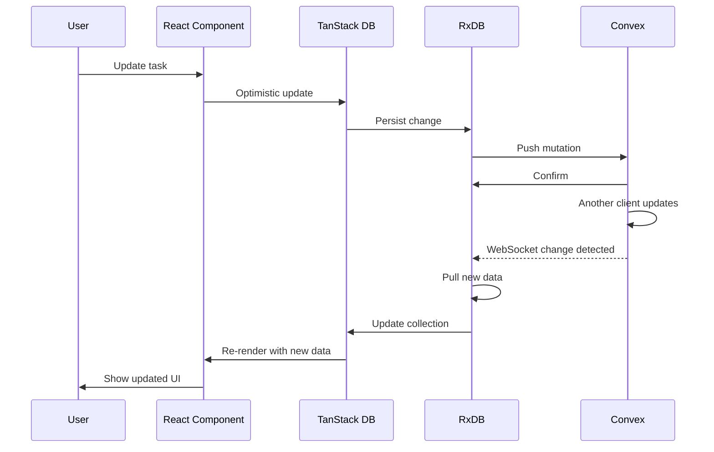

# ConvexRx - Offline-First Sync for React

A complete offline-first sync solution combining **Convex** (real-time backend), **RxDB** (local database), and **TanStack DB** (reactive state) with full TypeScript type safety.

## Features

- **Offline-first** - Works without internet, syncs when reconnected
- **Real-time sync** - Convex WebSocket-based bidirectional synchronization
- **Type-safe** - Full TypeScript support with zero `any` types
- **Auto-generated Convex functions** - No manual replication code needed
- **Flexible conflict resolution** - Server-wins, client-wins, last-write-wins, or custom merge
- **Cross-tab sync** - Changes sync instantly across browser tabs
- **SSR support** - Server-side rendering with data preloading
- **Clock skew handling** - Automatic time synchronization across clients
- **Network resilience** - Automatic retry with exponential backoff
- **Extensible** - Custom actions, queries, subscriptions, and middleware

## Packages

### `@convex-rx/core`
Framework-agnostic sync engine (614 lines):
- RxDB + Convex bidirectional replication
- Singleton management to prevent duplicate instances
- CRUD action factory with middleware support
- Conflict resolution strategies
- Clock skew detection and adjustment
- Network error handling with retry logic

### `@convex-rx/react`
React hooks with TanStack DB integration (550 lines):
- `useConvexRx` hook with automatic singleton management
- `ConvexRxProvider` for global configuration (**REQUIRED**)
- Optimistic UI updates
- Custom actions, queries, and subscriptions
- SSR data preloading

## Architecture

```mermaid
graph TB
    A[React Components] <-->|Subscribe| B[TanStack DB]
    B <-->|Persist| C[RxDB Local Storage]
    C <-->|Replicate| D[Convex Cloud]

    D -->|WebSocket| E[Change Stream]
    E -->|Detect| F[Pull New Data]
    F --> C

    C -->|Queue| G[Push Changes]
    G --> D

    H[@convex-rx/react] -.Wraps.- I[@convex-rx/core]
    I -.Manages.- C
    I -.Syncs with.- D

    style A fill:#61dafb
    style D fill:#f6792e
    style H fill:#61dafb
    style I fill:#3178c6
```

## Quick Start

### 1. Install Dependencies

```bash
bun install
```

### 2. Set Up ConvexRxProvider (REQUIRED)

```typescript
// src/app.tsx or src/routes/__root.tsx
import { ConvexRxProvider } from '@convex-rx/react';
import { ConvexReactClient } from 'convex/react';

const convexClient = new ConvexReactClient(import.meta.env.VITE_CONVEX_URL);

function App({ children }: { children: React.ReactNode }) {
  return (
    <ConvexRxProvider
      convexClient={convexClient}
      enableLogging={true}
    >
      {children}
    </ConvexRxProvider>
  );
}
```

**Why required?**
- Prevents module-level import timing issues
- Enables global configuration (logging, conflict handlers)
- Automatic singleton management across all hooks

### 3. Generate Convex Functions (Auto-Generated!)

```typescript
// convex/tasks.ts
import { generateConvexRxFunctions } from '@convex-rx/core/convex';
import { query, mutation } from './_generated/server';
import { v } from 'convex/values';

// Generate all 3 required functions automatically
const { changeStream, pullDocuments, pushDocuments } = generateConvexRxFunctions({
  tableName: 'tasks',
  query,
  mutation,
  v,
});

export { changeStream, pullDocuments, pushDocuments };
```

**That's it!** No manual replication code needed. The generator creates:
- `changeStream` - Real-time change detection
- `pullDocuments` - Incremental sync with index support
- `pushDocuments` - Conflict-aware mutations

### 4. Define Schema with Type-Safe Builder

```typescript
// src/hooks/useTasks.ts
import { createSchema, property } from '@convex-rx/react';

type Task = {
  text: string;
  isCompleted: boolean;
  priority: 'low' | 'medium' | 'high';
};

const taskSchema = createSchema<Task>('tasks', {
  text: property.string({ maxLength: 500 }),
  isCompleted: property.boolean(),
  priority: property.string(),
});
```

**Property builders available:**
- `property.string({ maxLength? })`
- `property.number({ min?, max?, integer? })`
- `property.boolean()`
- `property.array(itemType)`
- `property.object(properties)`

### 5. Create Your Hook

```typescript
// src/hooks/useTasks.ts
import { useConvexRx } from '@convex-rx/react';
import { api } from '../convex/_generated/api';

export function useTasks() {
  return useConvexRx({
    table: 'tasks',
    schema: taskSchema,
    convexApi: {
      changeStream: api.tasks.changeStream,
      pullDocuments: api.tasks.pullDocuments,
      pushDocuments: api.tasks.pushDocuments,
    },
    // Optional: Custom conflict resolution
    // conflictHandler: createLastWriteWinsHandler<Task>(),
  });
}
```

### 6. Use in Components

```typescript
// src/components/TaskList.tsx
import { useTasks } from '../hooks/useTasks';

export function TaskList() {
  const { data, status, actions } = useTasks();

  if (status.error) return <div>Error: {status.error.message}</div>;
  if (status.isLoading) return <div>Loading...</div>;

  return (
    <div>
      <button onClick={() => actions.insert({
        text: 'New task',
        isCompleted: false,
        priority: 'medium'
      })}>
        Add Task
      </button>

      {data.map(task => (
        <div key={task.id}>
          <input
            type="checkbox"
            checked={task.isCompleted}
            onChange={() => actions.update(task.id, { isCompleted: !task.isCompleted })}
          />
          <span>{task.text}</span>
          <button onClick={() => actions.delete(task.id)}>Delete</button>
        </div>
      ))}
    </div>
  );
}
```

## Advanced Features

### Error Handling

ConvexRx provides strongly-typed error objects for robust error handling:

```typescript
import { ErrorType } from '@convex-rx/react';

function TaskList() {
  const { data, status, actions } = useTasks();

  if (status.error) {
    // Type-safe error handling with switch statement
    switch (status.error.type) {
      case ErrorType.INITIALIZATION:
        return <div>Failed to initialize database. Please reload.</div>;

      case ErrorType.NETWORK:
        return <div>Network error. Check your connection.</div>;

      case ErrorType.REPLICATION:
        return <div>Sync error. Your changes are saved locally.</div>;

      case ErrorType.VALIDATION:
        return <div>Invalid data: {status.error.message}</div>;

      default:
        return <div>Error: {status.error.message}</div>;
    }
  }

  // ... rest of component
}
```

**Error Types:**
- `ErrorType.INITIALIZATION` - Database setup failed
- `ErrorType.REPLICATION` - Sync error between local and cloud
- `ErrorType.NETWORK` - Network connectivity issue
- `ErrorType.VALIDATION` - Schema validation failed
- `ErrorType.UNKNOWN` - Uncategorized error

**Error Object:**
```typescript
interface ConvexRxError {
  type: ErrorType;        // Category for type-safe handling
  message: string;        // Human-readable message
  cause?: unknown;        // Original error for debugging
}
```

### Conflict Resolution Strategies

```typescript
import {
  createLastWriteWinsHandler,
  createServerWinsHandler,
  createClientWinsHandler,
  createCustomMergeHandler
} from '@convex-rx/core';

// 1. Last-Write-Wins (Default)
useConvexRx({
  // ...config
  conflictHandler: createLastWriteWinsHandler<Task>()
});

// 2. Server Always Wins
useConvexRx({
  // ...config
  conflictHandler: createServerWinsHandler<Task>()
});

// 3. Custom Field-Level Merge
useConvexRx({
  // ...config
  conflictHandler: createCustomMergeHandler<Task>((input) => ({
    ...input.realMasterState,
    text: input.newDocumentState.text, // Keep client's text
    isCompleted: input.realMasterState.isCompleted, // Keep server's status
    updatedTime: Math.max(
      input.realMasterState.updatedTime,
      input.newDocumentState.updatedTime
    ),
  }))
});
```

### Custom Actions

```typescript
export function useTasks() {
  return useConvexRx({
    table: 'tasks',
    schema: taskSchema,
    convexApi: api.tasks,

    // Add custom actions
    actions: (baseActions, context) => ({
      toggleComplete: async (id: string) => {
        const doc = await context.rxCollection.findOne(id).exec();
        if (doc) {
          await baseActions.update(id, { isCompleted: !doc.isCompleted });
        }
      },

      completeAll: async () => {
        const docs = await context.rxCollection.find().exec();
        for (const doc of docs) {
          await baseActions.update(doc.id, { isCompleted: true });
        }
      },
    }),
  });
}

// Usage
const { actions } = useTasks();

// Base actions (always available)
await actions.insert({ text: 'New', isCompleted: false });
await actions.update('task-id', { isCompleted: true });
await actions.delete('task-id');

// Custom actions
await actions.toggleComplete('task-id');
await actions.completeAll();
```

### Custom Queries

```typescript
export function useTasks() {
  return useConvexRx({
    table: 'tasks',
    schema: taskSchema,
    convexApi: api.tasks,

    // Add custom queries
    queries: (context) => ({
      findByPriority: async (priority: 'low' | 'medium' | 'high') => {
        return await context.rxCollection
          .find({ selector: { priority } })
          .exec();
      },

      getCompletedCount: async () => {
        const docs = await context.rxCollection
          .find({ selector: { isCompleted: true } })
          .exec();
        return docs.length;
      },
    }),
  });
}

// Usage
const { queries } = useTasks();
const highPriority = await queries.findByPriority('high');
const count = await queries.getCompletedCount();
```

### Custom Subscriptions

```typescript
export function useTasks() {
  return useConvexRx({
    table: 'tasks',
    schema: taskSchema,
    convexApi: api.tasks,

    // Add custom subscriptions
    subscriptions: (context) => ({
      onHighPriorityAdded: (callback) => {
        return context.rxCollection
          .find({ selector: { priority: 'high' } })
          .$.subscribe(callback);
      },
    }),
  });
}

// Usage
const { subscribe } = useTasks();
const cleanup = subscribe.onHighPriorityAdded((tasks) => {
  console.log('High priority tasks:', tasks);
});
// Later: cleanup.unsubscribe() or cleanup()
```

### Middleware Hooks

```typescript
import type { MiddlewareConfig } from '@convex-rx/core';

const middleware: MiddlewareConfig<Task> = {
  beforeInsert: async (doc) => {
    console.log('Inserting:', doc);
    return { ...doc, createdAt: Date.now() };
  },

  afterInsert: async (id) => {
    console.log('Inserted:', id);
  },

  beforeUpdate: async (id, updates) => {
    console.log('Updating:', id, updates);
    return updates;
  },

  afterUpdate: async (id, updates) => {
    console.log('Updated:', id);
  },

  beforeDelete: async (id) => {
    console.log('Deleting:', id);
  },

  afterDelete: async (id) => {
    console.log('Deleted:', id);
  },

  onSyncError: (error) => {
    console.error('Sync error:', error);
  },
};

useConvexRx({
  table: 'tasks',
  schema: taskSchema,
  convexApi: api.tasks,
  middleware,
});
```

### Server-Side Rendering (SSR)

```typescript
// TanStack Start loader
import { createFileRoute } from '@tanstack/react-router';
import { preloadConvexRxData } from '@convex-rx/react/ssr';

export const Route = createFileRoute('/tasks')({
  loader: async () => {
    const tasks = await preloadConvexRxData({
      convexUrl: import.meta.env.VITE_CONVEX_URL,
      convexApi: { pullDocuments: api.tasks.pullDocuments },
      batchSize: 300,
    });

    return { initialTasks: tasks };
  },
});

// Component
function TasksPage() {
  const { initialTasks } = Route.useLoaderData();

  const { data, status } = useTasks({
    initialData: initialTasks, // No loading state on first render!
  });

  return <TaskList tasks={data} />;
}
```

## How It Works

### Real-Time Sync Flow



### Offline Behavior

- **Writes** - Queue locally in RxDB, sync when online
- **Reads** - Always work from local RxDB cache
- **UI** - Fully functional with optimistic updates
- **Conflicts** - Auto-resolved when reconnected

### Cross-Tab Sync

- **Local changes** - Instant sync via RxDB's multiInstance mode
- **Remote changes** - WebSocket streams propagate to all tabs
- **Single database** - One RxDB instance shared across tabs

## API Reference

### `useConvexRx<T>(config)`

```typescript
interface UseConvexRxConfig<T> {
  // Required
  table: string;
  schema: RxJsonSchema<T>;
  convexApi: {
    changeStream: ConvexQuery;
    pullDocuments: ConvexQuery;
    pushDocuments: ConvexMutation;
  };

  // Optional - Configuration
  databaseName?: string;
  batchSize?: number;
  pushBatchSize?: number;
  enableLogging?: boolean;
  conflictHandler?: RxConflictHandler<T>;
  storage?: StorageConfig;
  multiInstance?: boolean;

  // Optional - Extensions
  actions?: (base: BaseActions<T>, ctx: HookContext<T>) => TActions;
  queries?: (ctx: HookContext<T>) => TQueries;
  subscriptions?: (ctx: HookContext<T>) => TSubscriptions;
  middleware?: MiddlewareConfig<T>;

  // Optional - SSR
  initialData?: T[];
}

interface UseConvexRxResult<T> {
  // Data
  data: T[];

  // Status
  status: {
    isLoading: boolean;
    isReady: boolean;
    isReplicating: boolean;
    error: ConvexRxError | null;
  };

  // Actions (base + custom merged)
  actions: {
    // Base actions (always available)
    insert: (doc: Omit<T, 'id' | 'updatedTime' | '_deleted'>) => Promise<string>;
    update: (id: string, updates: Partial<Omit<T, 'id' | 'updatedTime' | '_deleted'>>) => Promise<void>;
    delete: (id: string) => Promise<void>;
    // ...plus any custom actions
  };

  // Queries and subscriptions
  queries: TQueries;
  subscribe: TSubscriptions;

  // Advanced
  collection: Collection<T> | null;
  rxCollection: RxCollection<T> | null;
  replicationState: RxReplicationState<T> | null;
  purgeStorage: () => Promise<void>;
}
```

### Property Builders

```typescript
import { property } from '@convex-rx/react';

// String
property.string({ maxLength?: number })

// Number
property.number({ min?: number, max?: number, integer?: boolean })
property.positiveNumber({ max?: number, integer?: boolean })

// Boolean
property.boolean()

// Array
property.array(itemDefinition: PropertyDefinition)

// Object
property.object(properties: Record<string, PropertyDefinition>)
```

### Conflict Handlers

```typescript
import {
  createLastWriteWinsHandler,
  createServerWinsHandler,
  createClientWinsHandler,
  createCustomMergeHandler,
} from '@convex-rx/core';

// Last-Write-Wins (default)
createLastWriteWinsHandler<T>(enableLogging?: boolean)

// Server-Wins
createServerWinsHandler<T>(enableLogging?: boolean)

// Client-Wins
createClientWinsHandler<T>(enableLogging?: boolean)

// Custom Merge
createCustomMergeHandler<T>(
  mergeFn: (input: RxConflictHandlerInput<T>) => T | Promise<T>,
  options?: {
    onError?: (error: Error, input: RxConflictHandlerInput<T>) => void | Promise<void>;
    fallbackStrategy?: 'server-wins' | 'client-wins';
    enableLogging?: boolean;
  }
)
```

## Development

### Building Packages

```bash
bun run build         # Build all packages
bun run build:core    # Build core only
bun run build:react   # Build React only
bun run clean         # Remove build artifacts
```

### Type Checking

```bash
bun run typecheck     # Check all packages
```

### Code Quality

```bash
bun run check         # Lint + format check
bun run check:fix     # Auto-fix all issues
```

### Running Example

```bash
bun run dev:example   # Start example app + Convex
```

## Examples

See `examples/tanstack-start/` for a complete implementation:
- `src/hooks/useTasks.ts` - Hook with custom actions and queries
- `src/routes/index.tsx` - Component usage
- `convex/tasks.ts` - Auto-generated Convex functions

## TypeScript Best Practices

This library follows strict TypeScript standards:
- Zero `any` types - use `unknown` for truly unknown values
- Const object pattern instead of enums
- Explicit return types on exported functions
- Trust TypeScript - no redundant runtime checks
- Proper generic constraints

See `CLAUDE.md` for detailed coding standards.

## License

MIT License - see LICENSE file for details
