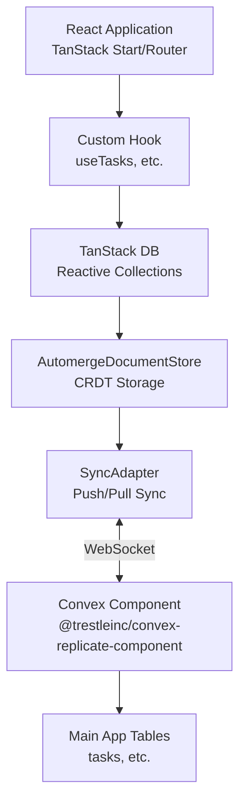
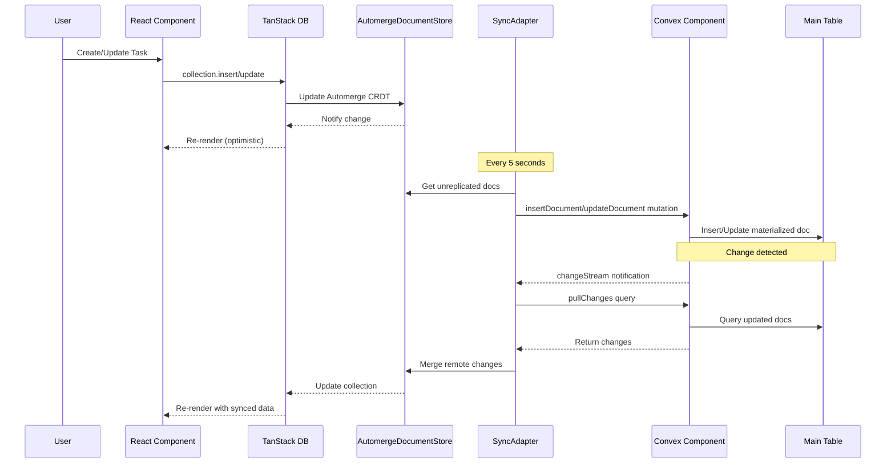
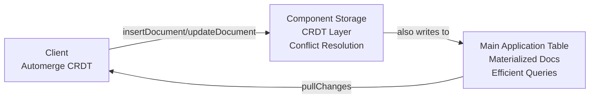

# Convex Replicate

**Offline-first sync library using Automerge CRDTs and Convex for real-time data synchronization.**

Convex Replicate provides a dual-storage architecture for building offline-capable applications with automatic conflict resolution. It combines Automerge CRDTs for local offline-first storage with Convex's reactive backend for real-time synchronization and efficient querying.

## Features

- **Offline-first** - Works without internet, syncs when reconnected
- **Automerge CRDTs** - Automatic conflict-free replication with Automerge
- **Real-time sync** - Convex WebSocket-based synchronization
- **TanStack DB integration** - Reactive state management for React
- **Dual-storage pattern** - CRDT layer for conflict resolution + main tables for queries
- **Type-safe** - Full TypeScript support
- **Cross-tab sync** - Changes sync instantly across browser tabs via BroadcastChannel
- **SSR support** - Server-side rendering with data preloading
- **Network resilience** - Automatic retry with exponential backoff
- **Component-based** - Convex component for plug-and-play CRDT storage

## Architecture

### High-Level Overview



### Data Flow: Real-Time Sync



### Dual-Storage Architecture



**Why both?**
- **Component Storage**: Handles conflict resolution with Automerge CRDTs, source of truth for offline changes
- **Main Tables**: Enables efficient server-side queries, joins, and reactive subscriptions
- Similar to event sourcing: component = event log, main table = read model

## Packages

### `@trestleinc/convex-replicate-core`

**Framework-agnostic utilities** - Replication helpers and SSR utilities for Convex Replicate.

**What it provides:**
- `convexCollectionOptions` - TanStack DB collection options for Automerge integration
- `loadCollection()` - SSR data preloading for instant page loads
- `AutomergeDocumentStore` - Local CRDT document storage
- `SyncAdapter` - Push/pull synchronization adapter
- Logging utilities via LogTape

**Use when:**
- Building React applications with TanStack DB
- Need SSR/SSG support (Next.js, Remix, TanStack Start)
- Building custom framework integrations

### `@trestleinc/convex-replicate-component`

**Convex component for CRDT storage** - Plug-and-play Convex component providing the backend storage layer.

**What it provides:**
- `ReplicateStorage` - Type-safe API for interacting with the component
- Internal CRDT storage table with indexes
- `insertDocument()` - Insert new documents with CRDT bytes
- `updateDocument()` - Update existing documents with CRDT bytes
- `deleteDocument()` - Delete documents
- `pullChanges()` - Incremental sync with checkpoints
- `changeStream()` - Real-time change detection

**Use when:**
- Setting up the backend Convex storage layer
- Need CRDT-based conflict resolution
- Want plug-and-play replication infrastructure

## Installation

```bash
# For React applications with TanStack DB
bun add @trestleinc/convex-replicate-core @trestleinc/convex-replicate-component convex @tanstack/react-db

# Or with npm
npm install @trestleinc/convex-replicate-core @trestleinc/convex-replicate-component convex @tanstack/react-db
```

## Quick Start

### Step 1: Install the Convex Component

Add the replicate component to your Convex app configuration:

```typescript
// convex/convex.config.ts
import { defineApp } from 'convex/server';
import replicate from '@trestleinc/convex-replicate-component/convex.config';

const app = defineApp();
app.use(replicate);

export default app;
```

### Step 2: Define Your Schema

Create your main application table with required fields:

```typescript
// convex/schema.ts
import { defineSchema, defineTable } from 'convex/server';
import { v } from 'convex/values';

export default defineSchema({
  tasks: defineTable({
    id: v.string(),              // Client-generated UUID
    text: v.string(),            // Your data
    isCompleted: v.boolean(),    // Your data
    version: v.number(),         // CRDT version
    timestamp: v.number(),       // Last modification time
    deleted: v.optional(v.boolean()), // Soft delete flag
  })
    .index('by_user_id', ['id'])      // Required for updates
    .index('by_timestamp', ['timestamp']), // Required for sync
});
```

**Required fields:**
- `id` - Client-generated UUID
- `version` - CRDT version number
- `timestamp` - Last modification timestamp
- `deleted` - Optional soft delete flag

### Step 3: Create Replication Functions

Create functions that use replication helpers for dual-storage pattern:

```typescript
// convex/tasks.ts
import { mutation, query } from './_generated/server';
import { components } from './_generated/api';
import { v } from 'convex/values';
import {
  insertDocumentHelper,
  updateDocumentHelper,
  deleteDocumentHelper,
  pullChangesHelper,
  changeStreamHelper,
} from '@trestleinc/convex-replicate-core';

/**
 * TanStack DB endpoints - called by convexCollectionOptions
 * These receive CRDT bytes from client and write to both:
 * 1. Component storage (CRDT bytes for conflict resolution)
 * 2. Main table (materialized docs for efficient queries)
 */

export const insertDocument = mutation({
  args: {
    collectionName: v.string(),
    documentId: v.string(),
    crdtBytes: v.bytes(),
    materializedDoc: v.any(),
    version: v.number(),
  },
  handler: async (ctx, args) => {
    return await insertDocumentHelper(ctx, components, 'tasks', {
      id: args.documentId,
      crdtBytes: args.crdtBytes,
      materializedDoc: args.materializedDoc,
      version: args.version,
    });
  },
});

export const updateDocument = mutation({
  args: {
    collectionName: v.string(),
    documentId: v.string(),
    crdtBytes: v.bytes(),
    materializedDoc: v.any(),
    version: v.number(),
  },
  handler: async (ctx, args) => {
    return await updateDocumentHelper(ctx, components, 'tasks', {
      id: args.documentId,
      crdtBytes: args.crdtBytes,
      materializedDoc: args.materializedDoc,
      version: args.version,
    });
  },
});

export const deleteDocument = mutation({
  args: {
    collectionName: v.string(),
    documentId: v.string(),
  },
  handler: async (ctx, args) => {
    return await deleteDocumentHelper(ctx, components, 'tasks', {
      id: args.documentId,
    });
  },
});

export const pullChanges = query({
  args: {
    collectionName: v.string(),
    checkpoint: v.object({ lastModified: v.number() }),
    limit: v.optional(v.number()),
  },
  handler: async (ctx, args) => {
    return await pullChangesHelper(ctx, components, 'tasks', {
      checkpoint: args.checkpoint,
      limit: args.limit,
    });
  },
});

export const changeStream = query({
  args: { collectionName: v.string() },
  handler: async (ctx) => {
    return await changeStreamHelper(ctx, components, 'tasks');
  },
});
```

### Step 4: Create a Custom Hook

Create a hook that wraps TanStack DB with Automerge collection options:

```typescript
// src/useTasks.ts
import { createCollection } from '@tanstack/react-db';
import { convexCollectionOptions } from '@trestleinc/convex-replicate-core';
import { api } from '../convex/_generated/api';
import { convexClient } from './router';
import { useMemo } from 'react';

export interface Task {
  id: string;
  text: string;
  isCompleted: boolean;
}

let tasksCollection: ReturnType<typeof createCollection<Task>> | null = null;

export function useTasks(initialData?: ReadonlyArray<Task>) {
  return useMemo(() => {
    if (!tasksCollection) {
      tasksCollection = createCollection(
        convexCollectionOptions<Task>({
          convexClient,
          api: api.tasks,  // Points to tasks.ts functions
          collectionName: 'tasks',
          getKey: (task) => task.id,
          initialData,
        })
      );
    }
    return tasksCollection;
  }, [initialData]);
}
```

### Step 5: Use in Components

```typescript
// src/routes/index.tsx
import { useLiveQuery } from '@tanstack/react-db';
import { useTasks } from '../useTasks';

export function TaskList() {
  const collection = useTasks();
  const { data: tasks, isLoading, isError } = useLiveQuery(collection);

  const handleCreate = () => {
    collection.insert({
      id: crypto.randomUUID(),
      text: 'New task',
      isCompleted: false,
    });
  };

  const handleUpdate = (id: string, isCompleted: boolean) => {
    collection.update(id, (draft) => {
      draft.isCompleted = !isCompleted;
    });
  };

  const handleDelete = (id: string) => {
    collection.delete(id);
  };

  if (isError) {
    return <div>Error loading tasks. Please refresh.</div>;
  }

  if (isLoading) {
    return <div>Loading tasks...</div>;
  }

  return (
    <div>
      <button onClick={handleCreate}>Add Task</button>

      {tasks.map((task) => (
        <div key={task.id}>
          <input
            type="checkbox"
            checked={task.isCompleted}
            onChange={() => handleUpdate(task.id, task.isCompleted)}
          />
          <span>{task.text}</span>
          <button onClick={() => handleDelete(task.id)}>Delete</button>
        </div>
      ))}
    </div>
  );
}
```

## Advanced Usage

### Server-Side Rendering (SSR)

Preload data on the server for instant page loads:

```typescript
// TanStack Start loader
import { createFileRoute } from '@tanstack/react-router';
import { loadCollection } from '@trestleinc/convex-replicate-core/ssr';
import { ConvexHttpClient } from 'convex/browser';
import { api } from '../convex/_generated/api';

export const Route = createFileRoute('/tasks')({
  loader: async () => {
    const httpClient = new ConvexHttpClient(import.meta.env.VITE_CONVEX_URL);

    const tasks = await loadCollection<Task>(httpClient, {
      api: api.tasks,
      collection: 'tasks',
      limit: 100,
    });

    return { tasks };
  },
});

function TasksPage() {
  const { tasks: initialTasks } = Route.useLoaderData();

  // Pass initialData to your hook
  const collection = useTasks(initialTasks);
  const { data: tasks } = useLiveQuery(collection);

  // No loading state on first render!
  return <TaskList tasks={tasks} />;
}
```

### Direct Component Usage (Advanced)

For direct backend integration, you can use `ReplicateStorage`:

```typescript
// convex/tasks.ts
import { ReplicateStorage } from '@trestleinc/convex-replicate-component';
import { mutation, query } from './_generated/server';
import { components } from './_generated/api';
import { v } from 'convex/values';

interface Task {
  id: string;
  text: string;
  isCompleted: boolean;
}

const tasksStorage = new ReplicateStorage<Task>(components.replicate, 'tasks');

export const insertTask = mutation({
  args: {
    id: v.string(),
    crdtBytes: v.bytes(),
    version: v.number(),
  },
  handler: async (ctx, args) => {
    return await tasksStorage.insertDocument(
      ctx,
      args.id,
      args.crdtBytes,
      args.version
    );
  },
});

export const updateTask = mutation({
  args: {
    id: v.string(),
    crdtBytes: v.bytes(),
    version: v.number(),
  },
  handler: async (ctx, args) => {
    return await tasksStorage.updateDocument(
      ctx,
      args.id,
      args.crdtBytes,
      args.version
    );
  },
});

export const getTasks = query({
  args: {
    checkpoint: v.object({ lastModified: v.number() }),
    limit: v.optional(v.number()),
  },
  handler: async (ctx, args) => {
    return await tasksStorage.pullChanges(ctx, args.checkpoint, args.limit);
  },
});

export const watchTasks = query({
  handler: async (ctx) => {
    return await tasksStorage.changeStream(ctx);
  },
});
```

### Logging Configuration

Configure logging for debugging and development:

```typescript
// src/routes/__root.tsx or app entry point
import { configure, getConsoleSink } from '@logtape/logtape';

await configure({
  sinks: { console: getConsoleSink() },
  loggers: [
    {
      category: ['convex-replicate'],
      lowestLevel: 'debug',
      sinks: ['console']
    }
  ],
});
```

Get a logger instance for custom logging:

```typescript
import { getLogger } from '@trestleinc/convex-replicate-core';

const logger = getLogger(['my-module']);

logger.info('Operation started', { userId: '123' });
logger.warn('Something unexpected', { reason: 'timeout' });
logger.error('Operation failed', { error });
```

## API Reference

### `@trestleinc/convex-replicate-core`

#### `convexCollectionOptions<T>(config)`

Creates collection options for TanStack DB with Automerge integration.

**Config:**
```typescript
interface ConvexAutomergeCollectionOptions<T> {
  convexClient: ConvexClient;
  api: {
    insertDocument: FunctionReference;
    updateDocument: FunctionReference;
    deleteDocument: FunctionReference;
    pullChanges: FunctionReference;
    changeStream: FunctionReference;
  };
  collectionName: string;
  getKey: (item: T) => string;
  initialData?: ReadonlyArray<T>;
}
```

**Returns:** Collection options for `createCollection()`

**Example:**
```typescript
const collection = createCollection(
  convexCollectionOptions<Task>({
    convexClient,
    api: api.tasks,
    collectionName: 'tasks',
    getKey: (task) => task.id,
    initialData,
  })
);
```

#### `loadCollection<T>(httpClient, config)`

Loads collection data during SSR for instant page loads.

**Parameters:**
- `httpClient` - ConvexHttpClient instance for server-side queries
- `config` - Configuration object:
  - `api` - The API module for replication functions
  - `collection` - Collection name
  - `limit?` - Maximum items to load (default: 100)

**Returns:** `Promise<ReadonlyArray<T>>`

**Example:**
```typescript
const tasks = await loadCollection<Task>(httpClient, {
  api: api.tasks,
  collection: 'tasks',
  limit: 50,
});
```

#### `getLogger(category)`

Get a logger instance for custom logging.

**Parameters:**
- `category` - Array of strings or single string for logger category

**Returns:** Logger with `debug()`, `info()`, `warn()`, `error()` methods

**Example:**
```typescript
const logger = getLogger(['hooks', 'useTasks']);
logger.debug('Task created', { id: taskId });
```

### `@trestleinc/convex-replicate-component`

#### `ReplicateStorage<TDocument>`

Type-safe API for interacting with the replicate component.

**Constructor:**
```typescript
new ReplicateStorage<TDocument>(component, collectionName)
```

**Methods:**

##### `insertDocument(ctx, documentId, crdtBytes, version)`
Insert a new document with CRDT bytes.

**Parameters:**
- `ctx` - Convex mutation context
- `documentId` - Unique document identifier
- `crdtBytes` - ArrayBuffer containing Automerge CRDT bytes
- `version` - CRDT version number

**Returns:** `Promise<{ success: boolean }>`

##### `updateDocument(ctx, documentId, crdtBytes, version)`
Update an existing document with CRDT bytes.

**Parameters:**
- `ctx` - Convex mutation context
- `documentId` - Unique document identifier
- `crdtBytes` - ArrayBuffer containing Automerge CRDT bytes
- `version` - CRDT version number

**Returns:** `Promise<{ success: boolean }>`

##### `deleteDocument(ctx, documentId)`
Delete a document.

**Parameters:**
- `ctx` - Convex mutation context
- `documentId` - Unique document identifier

**Returns:** `Promise<{ success: boolean }>`

##### `pullChanges(ctx, checkpoint, limit?)`
Pull document changes for incremental sync.

**Parameters:**
- `ctx` - Convex query context
- `checkpoint` - Object with `{ lastModified: number }`
- `limit` - Optional max changes (default: 100)

**Returns:**
```typescript
Promise<{
  changes: Array<{
    documentId: string;
    crdtBytes: ArrayBuffer;
    version: number;
    timestamp: number;
  }>;
  checkpoint: { lastModified: number };
  hasMore: boolean;
}>
```

##### `changeStream(ctx)`
Subscribe to collection changes.

**Parameters:**
- `ctx` - Convex query context

**Returns:** `Promise<{ timestamp: number; count: number }>`

## Performance

### Storage Performance

- **IndexedDB** via Automerge provides efficient local storage
- **TanStack DB** provides reactive queries with minimal re-renders
- **Batch operations** sync every 5 seconds to reduce network calls
- **Indexed queries** in Convex for fast incremental sync

### Sync Performance

- **Change streams** - WebSocket-based real-time updates
- **Incremental sync** - Only pull changed documents since last checkpoint
- **Optimistic UI** - Instant updates without waiting for server

### Cross-Tab Sync

- **BroadcastChannel** - Instant sync across browser tabs
- **Shared Automerge store** - Single source of truth per browser
- **No duplicate network requests** - Only one tab syncs with server

## Offline Behavior

### How It Works

- **Writes** - Queue locally in Automerge CRDT, sync when online
- **Reads** - Always work from local Automerge cache (instant!)
- **UI** - Fully functional with optimistic updates
- **Conflicts** - Auto-resolved by Automerge CRDTs (conflict-free!)

### Network Resilience

- Automatic retry with exponential backoff
- Network error detection (fetch errors, connection issues)
- Queue changes while offline
- Graceful degradation

## Examples

Complete working example: `examples/tanstack-start/`

**Files to explore:**
- `src/useTasks.ts` - Hook with TanStack DB integration
- `src/routes/index.tsx` - Component usage with SSR
- `src/routes/__root.tsx` - Logging configuration
- `convex/tasks.ts` - Replication functions using dual-storage helpers
- `convex/schema.ts` - Schema with required indexes

## Development

### Building Packages

```bash
bun run build         # Build all packages (component → core)
bun run build:component # Build component only
bun run build:core    # Build core only
bun run clean         # Remove build artifacts
```

### Type Checking

```bash
bun run typecheck     # Check all packages
```

### Code Quality

```bash
bun run check         # Lint + format check (dry run)
bun run check:fix     # Auto-fix all issues (run before committing)
bun run lint          # Lint only
bun run lint:fix      # Auto-fix lint issues
bun run format        # Format only
bun run format:check  # Check formatting
```

### Running Example

```bash
bun run dev:example   # Start example app + Convex dev environment
```

## Roadmap

- [ ] Partial sync (sync subset of collection)
- [ ] Delta sync (only sync changed fields)
- [ ] Encryption at rest
- [ ] Attachment support (files, images)
- [ ] Vue/Svelte wrappers
- [ ] React Native support
- [ ] Advanced Automerge features (counters, text editing)

## Contributing

Contributions welcome! Please see `CLAUDE.md` for coding standards.

## License

Apache-2.0 License - see [LICENSE](./LICENSE) file for details.

Copyright 2025 Trestle Inc
