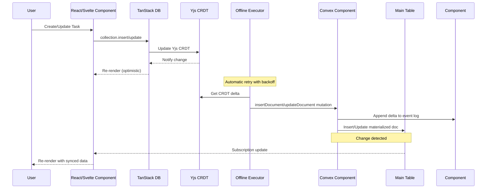
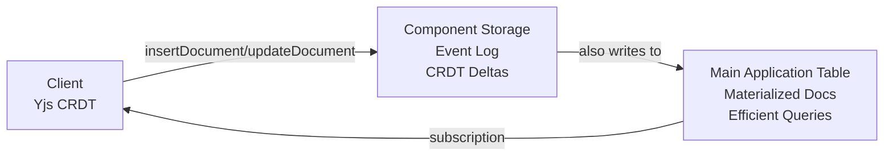

# Convex Replicate

**Offline-first sync library using Yjs CRDTs and Convex for real-time data synchronization.**

Convex Replicate provides a dual-storage architecture for building offline-capable applications with automatic conflict resolution. It combines Yjs CRDTs (96% smaller than Automerge, no WASM) with TanStack's offline transaction system and Convex's reactive backend for real-time synchronization and efficient querying.

## Features

- **Offline-first** - Works without internet, syncs when reconnected
- **Yjs CRDTs** - Automatic conflict-free replication with Yjs (96% smaller than Automerge, no WASM)
- **TanStack offline-transactions** - Proven outbox pattern for reliable offline sync
- **Real-time sync** - Convex WebSocket-based synchronization
- **TanStack DB integration** - Reactive state management for React and Svelte
- **Dual-storage pattern** - CRDT layer for conflict resolution + main tables for queries
- **Event sourcing** - Append-only event log preserves complete history
- **Type-safe** - Full TypeScript support
- **Multi-tab sync** - Changes sync instantly across browser tabs via TanStack coordination
- **SSR support** - Server-side rendering with data preloading
- **Network resilience** - Automatic retry with exponential backoff
- **Component-based** - Convex component for plug-and-play CRDT storage
- **React Native compatible** - No WASM dependency, works on mobile

## Architecture

### Data Flow: Real-Time Sync



### Dual-Storage Architecture



**Why both?**
- **Component Storage (Event Log)**: Append-only CRDT deltas, complete history, conflict resolution
- **Main Tables (Read Model)**: Current state, efficient server-side queries, indexes, and reactive subscriptions
- Similar to CQRS/Event Sourcing: component = event log, main table = materialized view

## Installation

```bash
# Using pnpm (recommended)
pnpm add @trestleinc/replicate

# Using npm (v7+)
npm install @trestleinc/replicate

# Using Bun
bun add @trestleinc/replicate
```

## Quick Start

### Step 1: Install the Convex Component

Add the replicate component to your Convex app configuration:

```typescript
// convex/convex.config.ts
import { defineApp } from 'convex/server';
import replicate from '@trestleinc/replicate/convex.config';

const app = defineApp();
app.use(replicate);

export default app;
```

### Step 2: Define Your Schema

Use the `replicatedTable` helper to automatically inject required fields:

```typescript
// convex/schema.ts
import { defineSchema } from 'convex/server';
import { v } from 'convex/values';
import { replicatedTable } from '@trestleinc/replicate/server';

export default defineSchema({
  tasks: replicatedTable(
    {
      // Your application fields only!
      // version and timestamp are automatically injected by replicatedTable
      id: v.string(),
      text: v.string(),
      isCompleted: v.boolean(),
    },
    (table) => table
      .index('by_user_id', ['id'])      // Required for document lookups
      .index('by_timestamp', ['timestamp']) // Required for incremental sync
  ),
});
```

**What `replicatedTable` does:**
- Automatically injects `version: v.number()` (for CRDT versioning)
- Automatically injects `timestamp: v.number()` (for incremental sync)
- You only define your business logic fields

**Required indexes:**
- `by_user_id` on `['id']` - Enables fast document lookups during updates
- `by_timestamp` on `['timestamp']` - Enables efficient incremental synchronization

### Step 3: Create Replication Functions

Create functions that use replication helpers for dual-storage pattern:

```typescript
// convex/tasks.ts
import { mutation, query } from './_generated/server';
import { components } from './_generated/api';
import { v } from 'convex/values';
import {
  insertDocumentHelper,
  updateDocumentHelper,
  deleteDocumentHelper,
} from '@trestleinc/replicate/server'; // IMPORTANT: Use /server for Convex functions!

/**
 * TanStack DB endpoints - called by convexCollectionOptions
 * These receive Yjs CRDT deltas from client and write to both:
 * 1. Component storage (Yjs CRDT deltas in event log)
 * 2. Main table (materialized docs for efficient queries)
 */

export const insertDocument = mutation({
  args: {
    collectionName: v.string(),
    documentId: v.string(),
    crdtBytes: v.bytes(),
    materializedDoc: v.any(),
    version: v.number(),
  },
  handler: async (ctx, args) => {
    return await insertDocumentHelper(ctx, components, 'tasks', {
      id: args.documentId,
      crdtBytes: args.crdtBytes,
      materializedDoc: args.materializedDoc,
      version: args.version,
    });
  },
});

export const updateDocument = mutation({
  args: {
    collectionName: v.string(),
    documentId: v.string(),
    crdtBytes: v.bytes(),
    materializedDoc: v.any(),
    version: v.number(),
  },
  handler: async (ctx, args) => {
    return await updateDocumentHelper(ctx, components, 'tasks', {
      id: args.documentId,
      crdtBytes: args.crdtBytes,
      materializedDoc: args.materializedDoc,
      version: args.version,
    });
  },
});

export const deleteDocument = mutation({
  args: {
    collectionName: v.string(),
    documentId: v.string(),
    crdtBytes: v.bytes(),
    version: v.number(),
  },
  handler: async (ctx, args) => {
    return await deleteDocumentHelper(ctx, components, 'tasks', {
      id: args.documentId,
      crdtBytes: args.crdtBytes,
      version: args.version,
    });
  },
});

/**
 * Stream endpoint for real-time subscriptions
 * Returns all active items (hard deletes are physically removed from table)
 */
export const stream = query({
  handler: async (ctx) => {
    return await ctx.db.query('tasks').collect();
  },
});
```

### Step 4: Create a Custom Hook

Create a hook that wraps TanStack DB with Convex collection options:

```typescript
// src/useTasks.ts
import { createCollection } from '@tanstack/react-db';
import {
  convexCollectionOptions,
  createConvexCollection,
  type ConvexCollection,
} from '@trestleinc/replicate/client';
import { api } from '../convex/_generated/api';
import { convexClient } from './router';
import { useMemo } from 'react';

export interface Task {
  id: string;
  text: string;
  isCompleted: boolean;
}

// Module-level singleton to prevent multiple collection instances
// This ensures only one sync process runs, even across component remounts
let tasksCollection: ConvexCollection<Task>;

export function useTasks(initialData?: ReadonlyArray<Task>) {
  return useMemo(() => {
    if (!tasksCollection) {
      // Step 1: Create raw TanStack DB collection with ALL config
      const rawCollection = createCollection(
        convexCollectionOptions<Task>({
          convexClient,
          api: {
            stream: api.tasks.stream,
            insertDocument: api.tasks.insertDocument,
            updateDocument: api.tasks.updateDocument,
            deleteDocument: api.tasks.deleteDocument,
          },
          collectionName: 'tasks',
          getKey: (task) => task.id,
          initialData,
        })
      );

      // Step 2: Wrap with Convex offline support (Yjs + TanStack)
      // Config is automatically extracted from rawCollection
      tasksCollection = createConvexCollection(rawCollection);
    }
    return tasksCollection;
  }, [initialData]);
}
```

### Step 5: Use in Components

```typescript
// src/routes/index.tsx
import { useLiveQuery } from '@tanstack/react-db';
import { useTasks } from '../useTasks';

export function TaskList() {
  const collection = useTasks();
  const { data: tasks, isLoading, isError } = useLiveQuery(collection);

  const handleCreate = () => {
    collection.insert({
      id: crypto.randomUUID(),
      text: 'New task',
      isCompleted: false,
    });
  };

  const handleUpdate = (id: string, isCompleted: boolean) => {
    collection.update(id, (draft: Task) => {
      draft.isCompleted = !isCompleted;
    });
  };

  const handleDelete = (id: string) => {
    // Hard delete - physically removes from main table
    collection.delete(id);
  };

  if (isError) {
    return <div>Error loading tasks. Please refresh.</div>;
  }

  if (isLoading) {
    return <div>Loading tasks...</div>;
  }

  return (
    <div>
      <button onClick={handleCreate}>Add Task</button>

      {tasks.map((task) => (
        <div key={task.id}>
          <input
            type="checkbox"
            checked={task.isCompleted}
            onChange={() => handleUpdate(task.id, task.isCompleted)}
          />
          <span>{task.text}</span>
          <button onClick={() => handleDelete(task.id)}>Delete</button>
        </div>
      ))}
    </div>
  );
}
```

## Delete Pattern: Hard Delete with Event History (v0.3.0+)

Convex Replicate uses **hard deletes** where items are physically removed from the main table, while the internal component preserves complete event history.

**Why hard delete?**
- Clean main table (no filtering required)
- Standard TanStack DB operations
- Complete audit trail preserved in component event log
- Proper CRDT conflict resolution maintained
- Foundation for future recovery features

**Implementation:**

```typescript
// Delete handler (uses collection.delete)
const handleDelete = (id: string) => {
  collection.delete(id);  // Hard delete - physically removes from main table
};

// UI usage - no filtering needed!
const { data: tasks } = useLiveQuery(collection);

// SSR loader - no filtering needed!
export const Route = createFileRoute('/')({
  loader: async () => {
    const tasks = await httpClient.query(api.tasks.stream);
    return { tasks };
  },
});
```

**How it works:**
1. Client calls `collection.delete(id)`
2. `onDelete` handler captures Yjs deletion delta
3. Delta appended to component event log (history preserved)
4. Main table: document physically removed
5. Other clients notified and item removed locally

**Server-side:** Returns only active items (deleted items are physically removed):

```typescript
// convex/tasks.ts
export const stream = query({
  handler: async (ctx) => {
    return await ctx.db.query('tasks').collect();
  },
});
```

**Dual Storage Architecture:**
- **Component Storage**: Append-only event log with complete history (including deletions)
- **Main Table**: Current state only (deleted items removed)

## Advanced Usage

### Server-Side Rendering (SSR)

Preload data on the server for instant page loads:

**Step 1: Create an SSR-friendly query**

```typescript
// convex/tasks.ts
export const getTasks = query({
  handler: async (ctx) => {
    return await ctx.db.query('tasks').collect();
  },
});
```

**Step 2: Load data in your route loader**

```typescript
// src/routes/index.tsx
import { createFileRoute } from '@tanstack/react-router';
import { ConvexHttpClient } from 'convex/browser';
import { api } from '../convex/_generated/api';
import type { Task } from '../useTasks';

const httpClient = new ConvexHttpClient(import.meta.env.VITE_CONVEX_URL);

export const Route = createFileRoute('/')({
  loader: async () => {
    const tasks = await httpClient.query(api.tasks.getTasks);
    return { tasks };
  },
});

function TasksPage() {
  const { tasks: initialTasks } = Route.useLoaderData();

  // Pass initialData to your hook
  const collection = useTasks(initialTasks);
  const { data: tasks } = useLiveQuery(collection);

  // No loading state on first render!
  return <TaskList tasks={tasks} />;
}
```

### Direct Component Usage (Advanced)

> **WARNING:** Using `ReplicateStorage` directly only writes to the component CRDT storage layer. It does NOT implement the dual-storage pattern (no writes to main table), which means:
> - You cannot query this data efficiently in Convex
> - You lose the benefits of reactive subscriptions on materialized docs
> - You'll need to manually handle materialization
> 
> **Recommended:** Use the replication helpers (`insertDocumentHelper`, etc.) shown in Step 3 for the full dual-storage pattern.

For advanced use cases where you need direct component access:

```typescript
// convex/tasks.ts
import { ReplicateStorage } from '@trestleinc/replicate/client';
import { mutation, query } from './_generated/server';
import { components } from './_generated/api';
import { v } from 'convex/values';

interface Task {
  id: string;
  text: string;
  isCompleted: boolean;
}

const tasksStorage = new ReplicateStorage<Task>(components.replicate, 'tasks');

export const insertTask = mutation({
  args: {
    id: v.string(),
    crdtBytes: v.bytes(),
    version: v.number(),
  },
  handler: async (ctx, args) => {
    return await tasksStorage.insertDocument(
      ctx,
      args.id,
      args.crdtBytes,
      args.version
    );
  },
});

export const updateTask = mutation({
  args: {
    id: v.string(),
    crdtBytes: v.bytes(),
    version: v.number(),
  },
  handler: async (ctx, args) => {
    return await tasksStorage.updateDocument(
      ctx,
      args.id,
      args.crdtBytes,
      args.version
    );
  },
});

export const streamChanges = query({
  args: {
    checkpoint: v.object({ lastModified: v.number() }),
    limit: v.optional(v.number()),
  },
  handler: async (ctx, args) => {
    return await tasksStorage.stream(ctx, args.checkpoint, args.limit);
  },
});
```

### Logging Configuration

Configure logging for debugging and development using LogTape:

```typescript
// src/routes/__root.tsx or app entry point
import { configure, getConsoleSink } from '@logtape/logtape';

await configure({
  sinks: { console: getConsoleSink() },
  loggers: [
    {
      category: ['convex-replicate'],
      lowestLevel: 'debug',  // 'debug' | 'info' | 'warn' | 'error'
      sinks: ['console']
    }
  ],
});
```

Get a logger instance for custom logging:

```typescript
import { getLogger } from '@trestleinc/replicate/client';

const logger = getLogger(['my-module']); // Accepts string or string array

logger.info('Operation started', { userId: '123' });
logger.warn('Something unexpected', { reason: 'timeout' });
logger.error('Operation failed', { error });
```

## API Reference

### Client-Side (`@trestleinc/replicate/client`)

#### `convexCollectionOptions<T>(config)`

Creates collection options for TanStack DB with Yjs CRDT integration.

**Config:**
```typescript
interface ConvexCollectionOptionsConfig<T> {
  convexClient: ConvexClient;
  api: {
    stream: FunctionReference;          // Real-time subscription endpoint
    insertDocument: FunctionReference;  // Insert mutation
    updateDocument: FunctionReference;  // Update mutation
    deleteDocument: FunctionReference;  // Delete mutation
  };
  collectionName: string;
  getKey: (item: T) => string | number;
  initialData?: ReadonlyArray<T>;
}
```

**Returns:** Collection options for `createCollection()`

**Example:**
```typescript
const rawCollection = createCollection(
  convexCollectionOptions<Task>({
    convexClient,
    api: {
      stream: api.tasks.stream,
      insertDocument: api.tasks.insertDocument,
      updateDocument: api.tasks.updateDocument,
      deleteDocument: api.tasks.deleteDocument,
    },
    collectionName: 'tasks',
    getKey: (task) => task.id,
    initialData,
  })
);

const collection = createConvexCollection(rawCollection);
```

#### `createConvexCollection<T>(rawCollection)`

Wraps a TanStack DB collection with offline support (Yjs + TanStack offline-transactions).

**Parameters:**
- `rawCollection` - Collection created with `createCollection(convexCollectionOptions(...))`

**Returns:** `ConvexCollection<T>` (just a type alias for `Collection<T>`)

**Example:**
```typescript
const collection = createConvexCollection(rawCollection);

// Use standard TanStack DB operations
collection.insert({ id: '1', text: 'Task 1', isCompleted: false });
collection.update('1', (draft) => { draft.isCompleted = true });
collection.delete('1');
```

#### `ReplicateStorage<TDocument>`

Type-safe API for direct component access (advanced).

**Constructor:**
```typescript
new ReplicateStorage<TDocument>(component, collectionName)
```

**Methods:**

##### `insertDocument(ctx, documentId, crdtBytes, version)`
Insert a new document with Yjs CRDT bytes.

**Parameters:**
- `ctx` - Convex mutation context
- `documentId` - Unique document identifier
- `crdtBytes` - ArrayBuffer containing Yjs CRDT bytes
- `version` - CRDT version number

**Returns:** `Promise<{ success: boolean }>`

##### `updateDocument(ctx, documentId, crdtBytes, version)`
Update an existing document with Yjs CRDT bytes.

**Parameters:**
- `ctx` - Convex mutation context
- `documentId` - Unique document identifier
- `crdtBytes` - ArrayBuffer containing Yjs CRDT bytes
- `version` - CRDT version number

**Returns:** `Promise<{ success: boolean }>`

##### `deleteDocument(ctx, documentId, crdtBytes, version)`
Delete a document (appends deletion delta to event log).

**Parameters:**
- `ctx` - Convex mutation context
- `documentId` - Unique document identifier
- `crdtBytes` - ArrayBuffer containing Yjs deletion delta
- `version` - CRDT version number

**Returns:** `Promise<{ success: boolean }>`

##### `stream(ctx, checkpoint, limit?)`
Pull document changes for incremental sync.

**Parameters:**
- `ctx` - Convex query context
- `checkpoint` - Object with `{ lastModified: number }`
- `limit` - Optional max changes (default: 100)

**Returns:**
```typescript
Promise<{
  changes: Array<{
    documentId: string;
    crdtBytes: ArrayBuffer;
    version: number;
    timestamp: number;
  }>;
  checkpoint: { lastModified: number };
  hasMore: boolean;
}>
```

#### `getLogger(category)`

Get a logger instance for custom logging.

**Parameters:**
- `category: string | string[]` - Logger category

**Returns:** Logger with `debug()`, `info()`, `warn()`, `error()` methods

**Examples:**
```typescript
const logger = getLogger('my-module');
const logger = getLogger(['hooks', 'useTasks']);

logger.debug('Task created', { id: taskId });
```

### Server-Side (`@trestleinc/replicate/server`)

#### `insertDocumentHelper(ctx, components, tableName, args)`

Insert a document into both the CRDT component and the main application table.

**Parameters:**
- `ctx` - Convex mutation context
- `components` - Generated components from Convex
- `tableName` - Name of the main application table
- `args` - `{ id: string; crdtBytes: ArrayBuffer; materializedDoc: any; version: number }`

**Returns:** `Promise<{ success: boolean; metadata: {...} }>`

#### `updateDocumentHelper(ctx, components, tableName, args)`

Update a document in both the CRDT component and the main application table.

**Parameters:**
- `ctx` - Convex mutation context
- `components` - Generated components from Convex
- `tableName` - Name of the main application table
- `args` - `{ id: string; crdtBytes: ArrayBuffer; materializedDoc: any; version: number }`

**Returns:** `Promise<{ success: boolean; metadata: {...} }>`

#### `deleteDocumentHelper(ctx, components, tableName, args)`

Hard delete from main table, append deletion delta to component event log.

**Parameters:**
- `ctx` - Convex mutation context
- `components` - Generated components from Convex
- `tableName` - Name of the main application table
- `args` - `{ id: string; crdtBytes: ArrayBuffer; version: number }`

**Returns:** `Promise<{ success: boolean; metadata: {...} }>`

#### `streamHelper(ctx, components, tableName, args)`

Stream CRDT deltas from component storage for incremental sync.

**Parameters:**
- `ctx` - Convex query context
- `components` - Generated components from Convex
- `tableName` - Name of the collection
- `args` - `{ checkpoint: { lastModified: number }; limit?: number }`

**Returns:** `Promise<{ changes: Array<...>; checkpoint: {...}; hasMore: boolean }>`

#### `replicatedTable(userFields, applyIndexes?)`

Automatically inject replication metadata fields (`version`, `timestamp`).

**Parameters:**
- `userFields` - User's business logic fields
- `applyIndexes` - Optional callback to add indexes

**Returns:** TableDefinition with replication fields injected

**Example:**
```typescript
tasks: replicatedTable(
  {
    id: v.string(),
    text: v.string(),
  },
  (table) => table
    .index('by_user_id', ['id'])
    .index('by_timestamp', ['timestamp'])
)
```

### SSR (`@trestleinc/replicate/ssr`)

#### `loadCollection<T>(httpClient, config)`

Load collection data during SSR for instant page loads.

**Note:** This function is deprecated. For most SSR use cases, create a dedicated query that reads from your main table.

**Parameters:**
- `httpClient` - ConvexHttpClient instance
- `config` - `{ api: CollectionAPI; collection: string; limit?: number }`

**Returns:** `Promise<ReadonlyArray<T>>`

## Performance

### Storage Performance

- **IndexedDB** via TanStack DB provides efficient local storage
- **Yjs** CRDT operations are extremely fast (96% smaller than Automerge)
- **TanStack offline-transactions** provides batching and retry logic
- **Indexed queries** in Convex for fast incremental sync

### Sync Performance

- **Real-time updates** - WebSocket-based change notifications
- **Delta encoding** - Only send what changed (< 1KB per change vs 100KB+ full state)
- **Event sourcing** - Append-only writes, no update conflicts
- **Optimistic UI** - Instant updates without waiting for server

### Multi-Tab Sync

- **TanStack coordination** - Built-in multi-tab sync via BroadcastChannel
- **Yjs shared state** - Single source of truth per browser
- **Offline executor** - Only one tab runs sync operations

## Offline Behavior

### How It Works

- **Writes** - Queue locally in Yjs CRDT, sync when online via TanStack outbox
- **Reads** - Always work from local TanStack DB cache (instant!)
- **UI** - Fully functional with optimistic updates
- **Conflicts** - Auto-resolved by Yjs CRDTs (conflict-free!)

### Network Resilience

- Automatic retry with exponential backoff
- Network error detection (fetch errors, connection issues)
- Queue changes while offline
- Graceful degradation

## Examples

Complete working example: `examples/tanstack-start/`

**Files to explore:**
- `src/useTasks.ts` - Hook with TanStack DB integration
- `src/routes/index.tsx` - Component usage with SSR
- `src/routes/__root.tsx` - Logging configuration
- `convex/tasks.ts` - Replication functions using dual-storage helpers
- `convex/schema.ts` - Schema with `replicatedTable` helper

**Run the example:**
```bash
cd examples/tanstack-start
pnpm install
pnpm run dev
```

## Development

### Building

```bash
pnpm run build         # Build package using Rslib
pnpm run clean         # Remove build artifacts
pnpm run typecheck     # Type check
```

### Code Quality

```bash
pnpm run check         # Lint + format check (dry run)
pnpm run check:fix     # Auto-fix all issues (run before committing)
pnpm run lint          # Lint only
pnpm run lint:fix      # Auto-fix lint issues
pnpm run format        # Format only
pnpm run format:check  # Check formatting
```

### Running Example

```bash
pnpm run dev:example   # Start example app + Convex dev environment
```

## Roadmap

- [ ] Partial sync (sync subset of collection)
- [ ] Delta sync (only sync changed fields)
- [ ] Encryption at rest
- [ ] Attachment support (files, images)
- [x] React Native support (works with Yjs v0.3.0+)
- [ ] Advanced Yjs features (rich text editing, shared cursors)
- [ ] Recovery features (restore deleted items from event log)

## Contributing

Contributions welcome! Please see `CLAUDE.md` for coding standards.

## License

Apache-2.0 License - see [LICENSE](./LICENSE) file for details.

Copyright 2025 Trestle Inc
