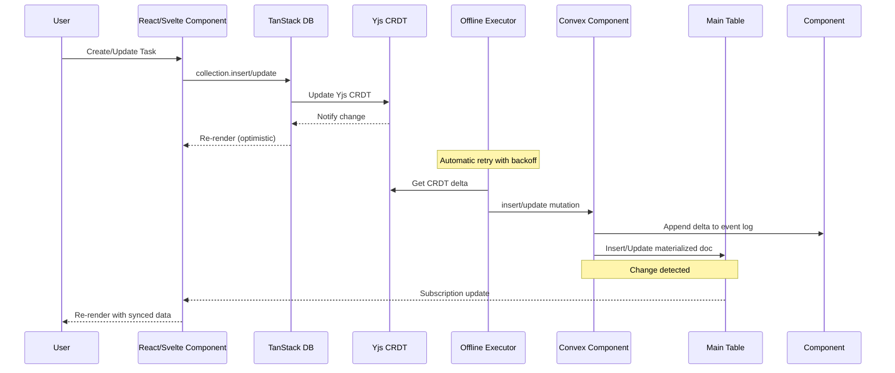
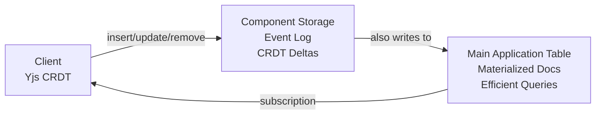
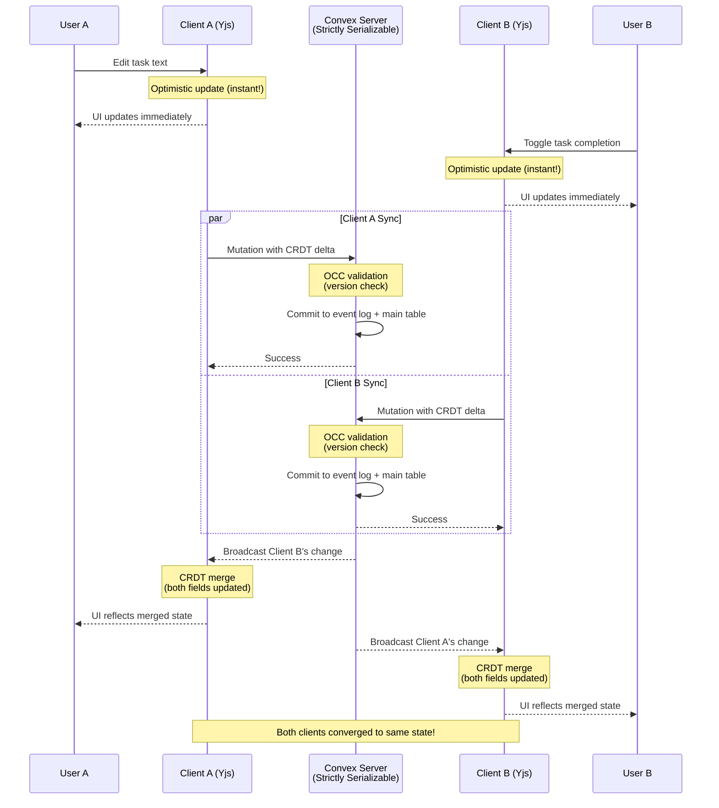

# Replicate

**Offline-first sync library using Yjs CRDTs and Convex for real-time data synchronization.**

Replicate provides a dual-storage architecture for building offline-capable applications with automatic conflict resolution. It combines Yjs CRDTs (96% smaller than Automerge, no WASM) with TanStack's offline transaction system and Convex's reactive backend for real-time synchronization and efficient querying.

## Features

- **Offline-first** - Works without internet, syncs when reconnected
- **Yjs CRDTs** - Automatic conflict-free replication with Yjs (96% smaller than Automerge, no WASM)
- **TanStack offline-transactions** - Proven outbox pattern for reliable offline sync
- **Real-time sync** - Convex WebSocket-based synchronization
- **TanStack DB integration** - Reactive state management for React and Svelte
- **Dual-storage pattern** - CRDT layer for conflict resolution + main tables for queries
- **Event sourcing** - Append-only event log preserves complete history
- **Type-safe** - Full TypeScript support
- **Multi-tab sync** - Changes sync instantly across browser tabs via TanStack coordination
- **SSR support** - Server-side rendering with data preloading
- **Network resilience** - Automatic retry with exponential backoff
- **Component-based** - Convex component for plug-and-play CRDT storage
- **React Native compatible** - No WASM dependency, works on mobile

## Architecture

### Data Flow: Real-Time Sync



### Dual-Storage Architecture



**Why both?**
- **Component Storage (Event Log)**: Append-only CRDT deltas, complete history, conflict resolution
- **Main Tables (Read Model)**: Current state, efficient server-side queries, indexes, and reactive subscriptions
- Similar to CQRS/Event Sourcing: component = event log, main table = materialized view

## Understanding Consistency Guarantees

Replicate combines two different consistency models to give you the best of both worlds: **strict ordering on the server** and **optimistic updates on the client**.

### Server-Side: Strictly Serializable (Convex)

On the server, **Convex guarantees strictly serializable transactions**. This means:

- **Single-threaded illusion**: All mutations appear to execute one-at-a-time, in order
- **Optimistic Concurrency Control (OCC)**: Like Git - if two transactions touch the same data:
  - Both read at their snapshot time
  - First to commit wins
  - Second fails and automatically retries with fresh data
- **Deterministic**: Same operations always produce the same result
- **"It just works"**: Most developers never need to think about concurrency

**Example: OCC in action**
```typescript
// Two users try to update the same task simultaneously

// User A's mutation (starts first)
READ task (version: 1, text: "Buy milk")
WRITE task (version: 2, text: "Buy milk and eggs")
IF task.version === 1 → ✅ Success!

// User B's mutation (concurrent)
READ task (version: 1, text: "Buy milk")
WRITE task (version: 2, text: "Buy bread")
IF task.version === 1 → ❌ Conflict! (Task is now version 2)
// Convex automatically retries with fresh data:
READ task (version: 2, text: "Buy milk and eggs")
WRITE task (version: 3, text: "Buy bread")
IF task.version === 2 → ✅ Success!
```

### Client-Side: Eventual Consistency (Yjs CRDTs)

On the client, **Yjs CRDTs provide eventual consistency with automatic conflict resolution**. This means:

- **Optimistic updates**: Changes show immediately in the UI (no waiting for server)
- **Automatic merging**: CRDTs resolve conflicts at the field level
- **Last-write-wins**: By default, the most recent edit to each field wins
- **Convergent**: All clients eventually reach the same state

**Example: CRDT merge**
```typescript
// Two users edit different fields of the same task offline

// User A (offline):
task.update({ isCompleted: true })  // Toggle checkbox

// User B (offline):
task.update({ text: "Buy organic milk" })  // Edit text

// When both come online:
// ✅ Both changes merge automatically!
// Final state: { text: "Buy organic milk", isCompleted: true }
```

### How Server and Client Work Together



### When to Use Optimistic Updates

Not all operations are suitable for client-side optimistic updates. Use this guide:

| Use Case | Recommendation | Reason |
|----------|---------------|--------|
| **Text editing** | ✅ Perfect | CRDTs excel at merging text changes |
| **Task completion toggles** | ✅ Perfect | Commutative operations (order doesn't matter) |
| **Collaborative notes** | ✅ Perfect | Multiple users editing different parts |
| **UI preferences** | ✅ Perfect | Low stakes, user-specific |
| **Comment threads** | ✅ Good | Append-only, rare conflicts |
| **Like/favorite buttons** | ✅ Good | Idempotent operations |
| **Inventory counts** | ⚠️ Careful | May need server validation to prevent overselling |
| **Rate limiting** | ⚠️ Careful | Client can't enforce limits reliably |
| **Counter increments** | ⚠️ Careful | Use server-side aggregation for accuracy |
| **Financial transactions** | ❌ Never | Must be server-only with strict validation |
| **Authorization checks** | ❌ Never | Security decisions belong on server |
| **Billing operations** | ❌ Never | Legal/compliance requirements |

**Rule of thumb**: Ask yourself: *"Can this data be temporarily inconsistent for a few seconds?"*
- If **yes** → Safe for optimistic updates
- If **no** → Keep it server-only

### Understanding Conflicts

Replicate handles two types of conflicts with different mechanisms:

#### Server Conflicts (OCC)
**Cause**: Two mutations modify the same document simultaneously
- **Detection**: Version number mismatch at commit time
- **Resolution**: Automatic retry with fresh snapshot
- **Result**: Deterministic ordering (one mutation wins, other retries)

```typescript
// Server detects: "This mutation read version 5, but it's now version 6"
// Convex automatically: Retry the mutation with version 6 data
```

#### Client Conflicts (CRDT)
**Cause**: Two users edit the same field offline
- **Detection**: CRDT vector clocks detect concurrent edits
- **Resolution**: Automatic field-level merge (last-write-wins by default)
- **Result**: Eventual consistency (both edits visible, most recent wins per field)

```typescript
// Client A: task.text = "Buy milk" (timestamp: 100)
// Client B: task.text = "Buy bread" (timestamp: 101)
// CRDT merge: task.text = "Buy bread" (last write wins)
```

**Key difference**: Server conflicts retry with new data. Client conflicts merge automatically.

### Best Practices

1. **Trust the server**: Use server mutations for business logic that must be correct
2. **Trust CRDTs for UX**: Use optimistic updates for immediate feedback on safe operations
3. **Validate on server**: Even with optimistic updates, always validate on the server
4. **Test offline scenarios**: Simulate offline mode to see how conflicts resolve
5. **Monitor conflict rates**: High conflict rates may indicate operations that shouldn't be optimistic

### Example: Good vs Bad Patterns

**✅ Good: Collaborative Task List**
```typescript
// Safe for optimistic updates
collection.update(taskId, (draft) => {
  draft.text = newText;        // Text editing - CRDTs handle this
  draft.isCompleted = !draft.isCompleted;  // Toggle - commutative
});
```

**❌ Bad: Inventory Decrement**
```typescript
// ❌ DON'T: Optimistic inventory decrement
collection.update(productId, (draft) => {
  draft.stock -= 1;  // Could lead to overselling!
});

// ✅ DO: Server-side with validation
await convexClient.mutation(api.products.decrementStock, {
  productId
});
// Server checks: if (product.stock > 0) then decrement
```

**✅ Good: Server-Only Financial Operation**
```typescript
// Keep money operations server-only
export const transferFunds = mutation({
  handler: async (ctx, { fromAccount, toAccount, amount }) => {
    // Strict validation, no optimistic updates
    const from = await ctx.db.get(fromAccount);
    if (from.balance < amount) {
      throw new Error("Insufficient funds");
    }

    // Atomic transaction
    await ctx.db.patch(fromAccount, {
      balance: from.balance - amount
    });
    await ctx.db.patch(toAccount, {
      balance: to.balance + amount
    });
  },
});
```

### Summary

- **Server = Strict ordering**: Convex ensures mutations execute in a deterministic order with OCC
- **Client = Optimistic merging**: Yjs CRDTs provide instant UI updates with automatic conflict resolution
- **Together**: You get both fast UX and correct business logic
- **Your job**: Choose the right tool for each operation (optimistic for UX, server-only for correctness)

This two-tier model gives you the best of both worlds: the **reliability of traditional databases** with the **responsiveness of real-time collaborative apps**.

## Installation

```bash
# Using pnpm (recommended)
pnpm add @trestleinc/replicate

# Using npm (v7+)
npm install @trestleinc/replicate

# Using Bun
bun add @trestleinc/replicate
```

## Quick Start

### Step 1: Install the Convex Component

Add the replicate component to your Convex app configuration:

```typescript
// convex/convex.config.ts
import { defineApp } from 'convex/server';
import replicate from '@trestleinc/replicate/convex.config';

const app = defineApp();
app.use(replicate);

export default app;
```

### Step 2: Define Your Schema

Use the `replicatedTable` helper to automatically inject required fields:

```typescript
// convex/schema.ts
import { defineSchema } from 'convex/server';
import { v } from 'convex/values';
import { replicatedTable } from '@trestleinc/replicate/server';

export default defineSchema({
  tasks: replicatedTable(
    {
      // Your application fields only!
      // version and timestamp are automatically injected by replicatedTable
      id: v.string(),
      text: v.string(),
      isCompleted: v.boolean(),
    },
    (table) => table
      .index('by_user_id', ['id'])      // Required for document lookups
      .index('by_timestamp', ['timestamp']) // Required for incremental sync
  ),
});
```

**What `replicatedTable` does:**
- Automatically injects `version: v.number()` (for CRDT versioning)
- Automatically injects `timestamp: v.number()` (for incremental sync)
- You only define your business logic fields

**Required indexes:**
- `by_user_id` on `['id']` - Enables fast document lookups during updates
- `by_timestamp` on `['timestamp']` - Enables efficient incremental synchronization

### Step 3: Create Replication Functions

Create functions using the `defineReplicate` builder for a simple one-step API:

```typescript
// convex/tasks.ts
import { defineReplicate } from '@trestleinc/replicate/server';
import { components } from './_generated/api';
import type { Task } from '../src/useTasks';

// One function call generates all operations
export const {
  stream,
  material,
  insert,
  update,
  remove,
  protocol,
  compact,
  prune
} = defineReplicate<Task>({
  component: components.replicate,
  collection: 'tasks',
  compaction: { retention: 90 },    // Optional: customize compaction (days)
  pruning: { retention: 180 }       // Optional: customize pruning (days)
});
```

**What `defineReplicate` generates:**

- `stream` - Real-time CRDT stream query (for client subscriptions)
- `material` - SSR-friendly query (for server-side rendering)
- `insert` - Dual-storage insert mutation
- `update` - Dual-storage update mutation
- `remove` - Dual-storage delete mutation
- `protocol` - Protocol version query (for client setup)
- `compact` - Compaction function (for cron jobs)
- `prune` - Snapshot cleanup function (for cron jobs)

### Step 4: Create a Custom Hook

Create a hook that wraps TanStack DB with Convex collection options:

```typescript
// src/useTasks.ts
import { createCollection } from '@tanstack/react-db';
import {
  convexCollectionOptions,
  handleReconnect,
  type ConvexCollection,
} from '@trestleinc/replicate/client';
import { api } from '../convex/_generated/api';
import { convexClient } from './router';
import { useMemo } from 'react';

export interface Task {
  id: string;
  text: string;
  isCompleted: boolean;
}

// Module-level singleton to prevent multiple collection instances
// This ensures only one sync process runs, even across component remounts
let tasksCollection: ConvexCollection<Task>;

export function useTasks(
  initialData?: { documents: Task[], checkpoint?: any, count?: number, crdtBytes?: Uint8Array }
) {
  return useMemo(() => {
    if (!tasksCollection) {
      tasksCollection = handleReconnect(
        createCollection(
          convexCollectionOptions<Task>({
            convexClient,
            api: api.tasks,
            collection: 'tasks',
            getKey: (task) => task.id,
            material: initialData,
          })
        )
      );
    }
    return tasksCollection;
  }, [initialData]);
}
```

### Step 5: Use in Components

```typescript
// src/routes/index.tsx
import { useLiveQuery } from '@tanstack/react-db';
import { useTasks } from '../useTasks';

export function TaskList() {
  const collection = useTasks();
  const { data: tasks, isLoading, isError } = useLiveQuery(collection);

  const handleCreate = () => {
    collection.insert({
      id: crypto.randomUUID(),
      text: 'New task',
      isCompleted: false,
    });
  };

  const handleUpdate = (id: string, isCompleted: boolean) => {
    collection.update(id, (draft: Task) => {
      draft.isCompleted = !isCompleted;
    });
  };

  const handleDelete = (id: string) => {
    // Hard delete - physically removes from main table
    collection.delete(id);
  };

  if (isError) {
    return <div>Error loading tasks. Please refresh.</div>;
  }

  if (isLoading) {
    return <div>Loading tasks...</div>;
  }

  return (
    <div>
      <button onClick={handleCreate}>Add Task</button>

      {tasks.map((task) => (
        <div key={task.id}>
          <input
            type="checkbox"
            checked={task.isCompleted}
            onChange={() => handleUpdate(task.id, task.isCompleted)}
          />
          <span>{task.text}</span>
          <button onClick={() => handleDelete(task.id)}>Delete</button>
        </div>
      ))}
    </div>
  );
}
```

## Delete Pattern: Hard Delete with Event History

Replicate uses **hard deletes** where items are physically removed from the main table, while the internal component preserves complete event history.

**Why hard delete?**
- Clean main table (no filtering required)
- Standard TanStack DB operations
- Complete audit trail preserved in component event log
- Proper CRDT conflict resolution maintained
- Foundation for future recovery features

**Implementation:**

```typescript
// Delete handler (uses collection.delete)
const handleDelete = (id: string) => {
  collection.delete(id);  // Hard delete - physically removes from main table
};

// UI usage - no filtering needed!
const { data: tasks } = useLiveQuery(collection);

// SSR loader - no filtering needed!
export const Route = createFileRoute('/')({
  loader: async () => {
    const tasks = await httpClient.query(api.tasks.material);
    return { tasks };
  },
});
```

**How it works:**
1. Client calls `collection.delete(id)`
2. `onRemove` handler captures Yjs deletion delta
3. Delta appended to component event log (history preserved)
4. Main table: document physically removed
5. Other clients notified and item removed locally

**Server-side:** Returns only active items (deleted items are physically removed):

```typescript
// convex/tasks.ts (using defineReplicate)
export const { stream, material, remove } = defineReplicate<Task>({
  component: components.replicate,
  collection: 'tasks'
});
```

**Dual Storage Architecture:**
- **Component Storage**: Append-only event log with complete history (including deletions)
- **Main Table**: Current state only (deleted items removed)

## Protocol Evolution & Migration

Replicate includes automatic protocol migration to handle package updates and breaking changes. When you update the NPM package and the protocol version changes, the system automatically migrates local IndexedDB structures.

### How It Works

1. **Automatic Check**: When you create your first collection, the library automatically checks protocol compatibility
2. **Automatic Migration**: If versions differ, it runs sequential migrations (v1 → v2 → v3)
3. **Local Storage Update**: The new version is stored locally for future checks

**Note:** Protocol setup happens automatically when you create your first collection - no manual configuration required! The library handles version checking and migrations transparently.

### Debugging Protocol Issues

Check protocol information:

```typescript
import { getProtocolInfo } from '@trestleinc/replicate/client';

const info = await getProtocolInfo(convexClient);
console.log('Server version:', info.serverVersion);
console.log('Local version:', info.localVersion);
console.log('Needs migration:', info.needsMigration);
```

### Migration Best Practices

- **Protocol checks are automatic** - happens when creating collections
- **Handle setup errors** gracefully in your app
- **Test migrations** by simulating version upgrades
- **Monitor protocol versions** in production for debugging

## Advanced Usage

### Server-Side Rendering (SSR)

Preload data on the server for instant page loads:

**Step 1: Use the `material` query from defineReplicate**

The `material` query is automatically generated by `defineReplicate` and returns all documents for SSR hydration.

**Step 2: Load data in your route loader**

```typescript
// src/routes/index.tsx
import { createFileRoute } from '@tanstack/react-router';
import { ConvexHttpClient } from 'convex/browser';
import { api } from '../convex/_generated/api';
import type { Task } from '../useTasks';

const httpClient = new ConvexHttpClient(import.meta.env.VITE_CONVEX_URL);

export const Route = createFileRoute('/')({
  loader: async () => {
    const tasks = await httpClient.query(api.tasks.material);
    return { tasks };
  },
});

function TasksPage() {
  const { tasks: initialTasks } = Route.useLoaderData();

  // Pass initialData to your hook
  const collection = useTasks(initialTasks);
  const { data: tasks } = useLiveQuery(collection);

  // No loading state on first render!
  return <TaskList tasks={tasks} />;
}
```

### Custom Hooks and Lifecycle Events (Advanced)

You can customize the behavior of generated functions using optional hooks:

```typescript
// convex/tasks.ts
import { defineReplicate } from '@trestleinc/replicate/server';
import { components } from './_generated/api';
import type { Task } from '../src/useTasks';

export const {
  stream,
  material,
  insert,
  update,
  remove,
  protocol
} = defineReplicate<Task>({
  component: components.replicate,
  collection: 'tasks',

  // Optional: Permission checks (eval* hooks validate before execution)
  hooks: {
    evalRead: async (ctx, collection) => {
      const userId = await ctx.auth.getUserIdentity();
      if (!userId) throw new Error('Unauthorized');
    },
    evalWrite: async (ctx, doc) => {
      const userId = await ctx.auth.getUserIdentity();
      if (!userId) throw new Error('Unauthorized');
      if (doc.ownerId !== userId.subject) throw new Error('Unauthorized');
    },
    evalRemove: async (ctx, documentId) => {
      const userId = await ctx.auth.getUserIdentity();
      if (!userId) throw new Error('Unauthorized');
    },

    // Optional: Lifecycle callbacks (on* hooks run after execution)
    onInsert: async (ctx, doc) => {
      console.log('Inserted:', doc);
    },
    onUpdate: async (ctx, doc) => {
      console.log('Updated:', doc);
    },
    onRemove: async (ctx, documentId) => {
      console.log('Removed:', documentId);
    }
  }
});
```

### Logging Configuration

Configure logging for debugging and development using LogTape:

```typescript
// src/routes/__root.tsx or app entry point
import { configure, getConsoleSink } from '@logtape/logtape';

await configure({
  sinks: { console: getConsoleSink() },
  loggers: [
    {
      category: ['convex-replicate'],
      lowestLevel: 'debug',  // 'debug' | 'info' | 'warn' | 'error'
      sinks: ['console']
    }
  ],
});
```

Get a logger instance for custom logging:

```typescript
import { getLogger } from '@trestleinc/replicate/client';

const logger = getLogger(['my-module']); // Accepts string or string array

logger.info('Operation started', { userId: '123' });
logger.warn('Something unexpected', { reason: 'timeout' });
logger.error('Operation failed', { error });
```

## API Reference

### Client-Side (`@trestleinc/replicate/client`)

#### `convexCollectionOptions<T>(config)`

Creates collection options for TanStack DB with Yjs CRDT integration.

**Config:**
```typescript
interface ConvexCollectionOptionsConfig<T> {
  convexClient: ConvexClient;
  api: {
    stream: FunctionReference;    // Real-time subscription endpoint
    insert: FunctionReference;    // Insert mutation
    update: FunctionReference;    // Update mutation
    remove: FunctionReference;    // Delete mutation
    protocol?: FunctionReference; // Protocol version query (optional)
  };
  collection: string;
  getKey: (item: T) => string | number;
  material?: Materialized<T>;     // SSR hydration data
  undoCaptureTimeout?: number;    // Undo stack merge window (default: 500ms)
}
```

**Returns:** Collection options for `createCollection()`

**Example:**
```typescript
const collection = handleReconnect(
  createCollection(
    convexCollectionOptions<Task>({
      convexClient,
      api: api.tasks,
      collection: 'tasks',
      getKey: (task) => task.id,
      material: initialData,
    })
  )
);
```

#### `handleReconnect<T>(rawCollection)`

Wraps a TanStack DB collection with offline transaction handling (Yjs + TanStack offline-transactions).

**Parameters:**
- `rawCollection` - Collection created with `createCollection(convexCollectionOptions(...))`

**Returns:** `ConvexCollection<T>` (type alias for `Collection<T>`)

**Example:**
```typescript
const collection = handleReconnect(rawCollection);

// Use standard TanStack DB operations
collection.insert({ id: '1', text: 'Task 1', isCompleted: false });
collection.update('1', (draft) => { draft.isCompleted = true });
collection.delete('1');
```

#### `ReplicateStorage<TDocument>`

Type-safe API for direct component access (advanced).

**Constructor:**
```typescript
new ReplicateStorage<TDocument>(component, collection)
```

**Methods:**

##### `insertDocument(ctx, documentId, crdtBytes, version)`
Insert a new document with Yjs CRDT bytes.

**Parameters:**
- `ctx` - Convex mutation context
- `documentId` - Unique document identifier
- `crdtBytes` - ArrayBuffer containing Yjs CRDT bytes
- `version` - CRDT version number

**Returns:** `Promise<{ success: boolean }>`

##### `updateDocument(ctx, documentId, crdtBytes, version)`
Update an existing document with Yjs CRDT bytes.

**Parameters:**
- `ctx` - Convex mutation context
- `documentId` - Unique document identifier
- `crdtBytes` - ArrayBuffer containing Yjs CRDT bytes
- `version` - CRDT version number

**Returns:** `Promise<{ success: boolean }>`

##### `deleteDocument(ctx, documentId, crdtBytes, version)`
Delete a document (appends deletion delta to event log).

**Parameters:**
- `ctx` - Convex mutation context
- `documentId` - Unique document identifier
- `crdtBytes` - ArrayBuffer containing Yjs deletion delta
- `version` - CRDT version number

**Returns:** `Promise<{ success: boolean }>`

##### `stream(ctx, checkpoint, limit?)`
Pull document changes for incremental sync.

**Parameters:**
- `ctx` - Convex query context
- `checkpoint` - Object with `{ lastModified: number }`
- `limit` - Optional max changes (default: 100)

**Returns:**
```typescript
Promise<{
  changes: Array<{
    documentId: string;
    crdtBytes: ArrayBuffer;
    version: number;
    timestamp: number;
  }>;
  checkpoint: { lastModified: number };
  hasMore: boolean;
}>
```

#### `getLogger(category)`

Get a logger instance for custom logging.

**Parameters:**
- `category: string | string[]` - Logger category

**Returns:** Logger with `debug()`, `info()`, `warn()`, `error()` methods

**Examples:**
```typescript
const logger = getLogger('my-module');
const logger = getLogger(['hooks', 'useTasks']);

logger.debug('Task created', { id: taskId });
```

### Server-Side (`@trestleinc/replicate/server`)

#### `defineReplicate<T>(config)`

One-step builder function that generates all 8 operations for a collection.

**Config:**
```typescript
interface DefineReplicateConfig<T> {
  component: any;              // components.replicate
  collection: string;          // Collection name (e.g., 'tasks')

  // Optional: Compaction settings
  compaction?: {
    retention: number;         // Days to retain deltas (default: 90)
  };

  // Optional: Pruning settings
  pruning?: {
    retention: number;         // Days to retain snapshots (default: 180)
  };

  // Optional: Hooks for permissions and lifecycle
  hooks?: {
    // Permission checks (throw to reject)
    evalRead?: (ctx, collection) => Promise<void>;
    evalWrite?: (ctx, doc) => Promise<void>;
    evalRemove?: (ctx, documentId) => Promise<void>;

    // Lifecycle callbacks (run after operation)
    onInsert?: (ctx, doc) => Promise<void>;
    onUpdate?: (ctx, doc) => Promise<void>;
    onRemove?: (ctx, documentId) => Promise<void>;
  };
}
```

**Returns:** Object with generated functions:
- `stream` - Real-time CRDT stream query
- `material` - SSR-friendly query for hydration
- `insert` - Dual-storage insert mutation
- `update` - Dual-storage update mutation
- `remove` - Dual-storage delete mutation
- `protocol` - Protocol version query
- `compact` - Compaction function for cron jobs
- `prune` - Snapshot cleanup function for cron jobs

**Example:**
```typescript
// Basic usage
export const {
  stream,
  material,
  insert,
  update,
  remove,
  protocol,
  compact,
  prune
} = defineReplicate<Task>({
  component: components.replicate,
  collection: 'tasks'
});

// With custom settings
export const {
  stream,
  material,
  insert,
  update,
  remove,
  protocol,
  compact,
  prune
} = defineReplicate<User>({
  component: components.replicate,
  collection: 'users',
  compaction: { retention: 30 },
  pruning: { retention: 90 },
  hooks: {
    evalWrite: async (ctx, doc) => {
      const userId = await ctx.auth.getUserIdentity();
      if (!userId) throw new Error('Unauthorized');
    }
  }
});
```

#### `replicatedTable(userFields, applyIndexes?)`

Automatically inject replication metadata fields (`version`, `timestamp`).

**Parameters:**
- `userFields` - User's business logic fields
- `applyIndexes` - Optional callback to add indexes

**Returns:** TableDefinition with replication fields injected

**Example:**
```typescript
tasks: replicatedTable(
  {
    id: v.string(),
    text: v.string(),
  },
  (table) => table
    .index('by_user_id', ['id'])
    .index('by_timestamp', ['timestamp'])
)
```

### SSR (`@trestleinc/replicate/ssr`)

#### `loadCollection<T>(httpClient, config)`

Load collection data during SSR for instant page loads.

**Note:** This function is deprecated. For most SSR use cases, create a dedicated query that reads from your main table.

**Parameters:**
- `httpClient` - ConvexHttpClient instance
- `config` - `{ api: CollectionAPI; collection: string; limit?: number }`

**Returns:** `Promise<ReadonlyArray<T>>`

## Performance

### Storage Performance

- **IndexedDB** via TanStack DB provides efficient local storage
- **Yjs** CRDT operations are extremely fast (96% smaller than Automerge)
- **TanStack offline-transactions** provides batching and retry logic
- **Indexed queries** in Convex for fast incremental sync

### Sync Performance

- **Real-time updates** - WebSocket-based change notifications
- **Delta encoding** - Only send what changed (< 1KB per change vs 100KB+ full state)
- **Event sourcing** - Append-only writes, no update conflicts
- **Optimistic UI** - Instant updates without waiting for server

### Multi-Tab Sync

- **TanStack coordination** - Built-in multi-tab sync via BroadcastChannel
- **Yjs shared state** - Single source of truth per browser
- **Offline executor** - Only one tab runs sync operations

## Offline Behavior

### How It Works

- **Writes** - Queue locally in Yjs CRDT, sync when online via TanStack outbox
- **Reads** - Always work from local TanStack DB cache (instant!)
- **UI** - Fully functional with optimistic updates
- **Conflicts** - Auto-resolved by Yjs CRDTs (conflict-free!)

### Network Resilience

- Automatic retry with exponential backoff
- Network error detection (fetch errors, connection issues)
- Queue changes while offline
- Graceful degradation

## Examples

Complete working example: `examples/tanstack-start/`

**Files to explore:**
- `src/useTasks.ts` - Hook with TanStack DB integration
- `src/routes/index.tsx` - Component usage with SSR
- `src/routes/__root.tsx` - Logging configuration
- `convex/tasks.ts` - Replication functions using dual-storage helpers
- `convex/schema.ts` - Schema with `replicatedTable` helper

**Run the example:**
```bash
cd examples/tanstack-start
pnpm install
pnpm run dev
```

## Development

### Building

```bash
pnpm run build         # Build package using Rslib
pnpm run clean         # Remove build artifacts
pnpm run typecheck     # Type check
```

### Code Quality

```bash
pnpm run check         # Lint + format check (dry run)
pnpm run check:fix     # Auto-fix all issues (run before committing)
pnpm run lint          # Lint only
pnpm run lint:fix      # Auto-fix lint issues
pnpm run format        # Format only
pnpm run format:check  # Check formatting
```

### Running Example

```bash
pnpm run dev:example   # Start example app + Convex dev environment
```

## Production Readiness Deep-Dive

> A comprehensive technical analysis of Replicate's sync engine capabilities, answering the critical questions from Convex's "Object Sync" paper.

**Current Status: 7/7 Fully Implemented** 

Replicate has been architected from the ground up to handle production requirements for local-first sync systems. Below we address each of Jamie Turner's critical questions with our actual implementation patterns.

---

### 1. Consistency Model: Server-side Serializable vs. Client-side CRDTs

**Status: FULLY IMPLEMENTED**

**The Challenge:**
How do you reconcile server-side strictly serializable transactions with client-side optimistic updates?

**Our Solution: Server Reconciliation with CRDT-ish Mutations**

Replicate uses a hybrid approach aligned with Convex's recommended "Server Reconciliation" pattern:

- **Server-side:** Convex's serializable transaction system guarantees strict serializability
- **Client-side:** Yjs CRDTs provide field-level conflict resolution
- **Pattern:** Mutations are "CRDT-ish" - self-contained units resilient to different views

```typescript
// Server: Serializable transactions via Convex
export const updateDocument = tasksStorage.createUpdateMutation();

// Client: CRDT conflict resolution via Yjs
ydoc.transact(() => {
  itemYMap.set('text', newText); // Field-level CRDT
}, 'update');
```

**Key Insight:** This is exactly the pattern recommended by Convex's Object Sync paper - serializable server + CRDT client is the sweet spot for local-first apps!

---

### 2. Type Sharing: One Schema, Many Consumers

**Status: FULLY IMPLEMENTED**

**The Challenge:**
How do you keep client and server schemas in sync without manual duplication?

**Our Solution: Schema-Based Type Generation**

Replicate uses the `replicatedTable()` helper for automatic type sharing:

```typescript
// convex/schema.ts - Define once
export default defineSchema({
  tasks: replicatedTable({
    id: v.string(),
    text: v.string(),
    isCompleted: v.boolean(),
  }, (table) => table
    .index('by_user_id', ['id'])
    .index('by_timestamp', ['timestamp'])
  )
});

// Types automatically generated for client/server via Convex codegen
// Used in both convex/tasks.ts and src/useTasks.ts
```

**What `replicatedTable` does:**
- Automatically injects `version: v.number()` and `timestamp: v.number()`
- Users only define business logic fields
- Single source of truth via Convex's type generation

**Pattern match:** Similar to Replicache's "shared Zod validators" and Convex's planned `defineLocalSchema`.

---

### 3. Long Histories: Compaction and Storage Management

**Status: FULLY IMPLEMENTED**

**The Challenge:**
How do you prevent unbounded growth of CRDT deltas while preserving history?

**Our Solution: Cron-Based Compaction with State Vector Sync**

Replicate uses an event-sourced architecture with automatic compaction:

```typescript
// convex/crons.ts - Automatic compaction schedule
const crons = cronJobs();

// Daily compaction at 3am UTC
crons.daily('compact tasks',
  { hourUTC: 3, minuteUTC: 0 },
  internal.tasks.compact,
  {}
);

// Weekly snapshot cleanup on Sundays
crons.weekly('prune tasks snapshots',
  { dayOfWeek: 'sunday', hourUTC: 3, minuteUTC: 0 },
  internal.tasks.prune,
  {}
);
```

**Architecture Benefits:**
- **Zero per-mutation overhead** - No size calculations on every write
- **Predictable timing and costs** - Compaction runs at scheduled times
- **Simpler architecture** - No threshold monitoring or triggers needed
- **Better operational model** - Easier to budget around scheduled maintenance

**How Compaction Works:**

1. **Merge old deltas** - Uses `Y.mergeUpdates()` to consolidate deltas (memory-efficient!)
2. **Create snapshot** - `Y.snapshot()` + `Y.encodeSnapshotV2()` for compression
3. **Validate** - `Y.snapshotContainsUpdate()` verifies correctness
4. **Delete old deltas** - Free up storage while keeping snapshots
5. **Difference detection** - Stream query automatically serves snapshots when deltas unavailable

**Key Insight:** Yjs works perfectly in Convex's standard runtime - no Node.js actions needed! Compaction runs in mutations with full ACID guarantees.

---

### 4. Schema Flexibility: Evolving Your Data Model

**Status: BUILT-IN (No Migration Code Needed!)**

**The Challenge:**
How do you evolve your data model without complex migration scripts?

**Our Solution: Yjs Field-Level CRDTs Eliminate Migrations**

Traditional sync systems require migration code when schemas change. Replicate doesn't - Yjs Maps handle schema evolution naturally at the field level:

```typescript
// Version 1: Original schema
interface TaskV1 {
  id: string;
  text: string;
}

// Version 2: Added priority field
interface TaskV2 {
  id: string;
  text: string;
  priority: 'low' | 'medium' | 'high';  // New field!
}

// No migration code needed! Just update your TypeScript types.
// Old clients: Continue working, just don't see/set priority
// New clients: See priority as undefined for old docs, can set it
```

**Why This Works:**

| Schema Change | Traditional Approach | Replicate with Yjs |
|---------------|---------------------|-------------------|
| **Add field** | Write migration, track versions | Just add it - Yjs Maps handle sparse data |
| **Remove field** | Write migration, handle old data | Just remove it - old data ignored |
| **Rename field** | Write migration, transform data | Treat as add new + ignore old |
| **Change type** | Complex migration logic | Handle at application level |

**How Yjs Handles It:**

1. **Sparse Maps**: Yjs Maps don't require all fields - missing fields return `undefined`
2. **Field-Level Sync**: Each field syncs independently, not the whole document
3. **No Version Tracking**: No `_schemaVersion` metadata to manage
4. **Backward Compatible**: Old clients ignore fields they don't know about

**Example: Adding a Priority Field**

```typescript
// Old client code (still works!)
collection.update(taskId, (draft) => {
  draft.text = 'Updated text';  // Works fine
  // Doesn't know about priority - that's OK!
});

// New client code
collection.update(taskId, (draft) => {
  draft.text = 'Updated text';
  draft.priority = 'high';  // Sets new field
});

// Both clients sync correctly - no conflicts, no migrations!
```

**Key Insight:** By using field-level CRDTs instead of document-level versioning, schema evolution becomes a non-issue. This is one of the major advantages of Yjs over traditional sync approaches!

---

### 5. Protocol Evolution: Updating the Sync Protocol

**Status: FULLY IMPLEMENTED**

**The Challenge:**
How do you evolve the Replicate API without breaking existing clients?

**Our Solution: Protocol Version with Local Storage Migration**

Replicate uses simple protocol versioning:

```typescript
// src/component/public.ts
export const PROTOCOL_VERSION = 1;

export const getProtocolVersion = query({
  handler: async (_ctx) => {
    return { protocolVersion: PROTOCOL_VERSION };
  },
});
```

**Client-Side Setup:**

```typescript
// On app startup
const serverVersion = await convexClient.query(api.replicate.getProtocolVersion);
const localVersion = await getLocalProtocolVersion();

if (localVersion < serverVersion.protocolVersion) {
  // Migrate IndexedDB to new protocol format
  await migrateLocalStorage(localVersion, serverVersion.protocolVersion);
  await storeProtocolVersion(serverVersion.protocolVersion);
}
```

**Breaking Changes Handled:**
- Add optional field: ✅ Convex handles automatically
- Add required field: ❌ Requires NPM package update + local storage migration
- Remove/change field: ❌ Blocks syncing, clear error message to update

**Note:** Protocol version only applies to the Replicate library's internal API - your application schema changes are handled automatically by Yjs (see Schema Flexibility above).

---

### 6. Reset Handling: Difference Detection and Transparent Recovery

**Status: FULLY IMPLEMENTED** (via difference detection!)

**The Challenge:**
What happens when a client is so far behind that deltas were compacted?

**Our Solution: Automatic Difference Detection with State Vector Sync**

This is where Replicate really shines - **reset handling is already built into our stream query!** Let's look at the actual code:

```typescript
// src/component/public.ts (lines 123-258)
export const stream = query({
  args: {
    collection: v.string(),
    checkpoint: v.object({ lastModified: v.number() }),
    vector: v.optional(v.bytes()), // Client's CRDT state
    limit: v.optional(v.number()),
  },
  handler: async (ctx, args) => {
    // 1. Try normal incremental sync first
    const documents = await ctx.db
      .query('documents')
      .withIndex('by_timestamp', (q) =>
        q.eq('collection', args.collection)
         .gt('timestamp', args.checkpoint.lastModified)
      )
      .order('asc')
      .take(limit);

    if (documents.length > 0) {
      // Normal case: return incremental deltas
      return { changes: documents, ... };
    }

    // 2. Check for difference (client too far behind)
    const oldestDelta = await ctx.db
      .query('documents')
      .withIndex('by_timestamp', (q) =>
        q.eq('collection', args.collection))
      .order('asc')
      .first();

    // 3. DIFFERENCE DETECTED = RESET HANDLING!
    if (oldestDelta && args.checkpoint.lastModified < oldestDelta.timestamp) {
      const snapshot = await ctx.db
        .query('snapshots')
        .withIndex('by_collection', (q) =>
          q.eq('collection', args.collection))
        .order('desc')
        .first();

      // 4. State vector preserves offline changes!
      if (args.vector) {
        const ydoc = new Y.Doc({ guid: args.collection });
        const snapshotDecoded = Y.decodeSnapshotV2(
          new Uint8Array(snapshot.snapshotBytes)
        );
        const snapshotDoc = Y.createDocFromSnapshot(ydoc, snapshotDecoded);

        // Compute MINIMAL diff (snapshot - clientState)
        const diff = Y.encodeStateAsUpdateV2(
          snapshotDoc,
          new Uint8Array(args.vector)
        );

        return {
          changes: [{ crdtBytes: diff.buffer, ... }],
          checkpoint: { lastModified: snapshot.latestCompactionTimestamp },
          hasMore: false,
        };
      }

      // 5. Fallback: send full snapshot
      return {
        changes: [{ crdtBytes: snapshot.snapshotBytes, ... }],
        checkpoint: { lastModified: snapshot.latestCompactionTimestamp },
        hasMore: false,
      };
    }

    // 6. Caught up - no difference, just no new changes
    return { changes: [], checkpoint: args.checkpoint, hasMore: false };
  }
});
```

**How It Works:**

1. **Try incremental sync** - Return deltas if available (lines 150-175)
2. **Detect difference** - Check if client's checkpoint is before oldest delta (lines 180-188)
3. **Serve snapshot** - Fetch latest snapshot when difference detected (lines 191-195)
4. **Preserve offline changes** - Use state vector to compute minimal diff (lines 207-232)
5. **Transparent to client** - Looks just like normal sync!

**Key Insights:**

- **No special client handling** - Client doesn't know if it received deltas or snapshot
- **No data loss** - State vectors preserve client's offline changes during "reset"
- **No `resetRequired` flags** - Difference detection IS the reset handling
- **Much simpler** - No manual edit detection, no synthetic delta generation, no corruption detection

**This is way simpler than originally planned!** The "reset handling" section in our old docs described a complex system. Our actual implementation is elegant - difference detection + state vectors = transparent reset handling!

---

### 7. Authorization: Standard Convex Patterns + Optional Hooks

**Status: FULLY IMPLEMENTED**

**The Challenge:**
How do you handle authorization in local-first systems with optimistic updates?

**Our Answer: Use Standard Convex Patterns**

Authorization in Replicate is straightforward - use Convex's built-in `ctx.auth`:

```typescript
// Standard Convex auth - check in mutations
export const insertDocument = tasksStorage.createInsertMutation({
  checkWrite: async (ctx, doc) => {
    const userId = await ctx.auth.getUserIdentity();
    if (!userId) throw new Error('Unauthorized');
    if (doc.ownerId !== userId.subject) throw new Error('Unauthorized');
  },
});

// Filter queries by user
export const stream = tasksStorage.createStreamQuery({
  checkRead: async (ctx, collection) => {
    const userId = await ctx.auth.getUserIdentity();
    if (!userId) throw new Error('Unauthorized');
  },
});
```

**What We Provide:**

- Optional permission hooks: `checkRead`, `checkWrite`, `checkDelete` (if you want them)
- Optional lifecycle callbacks: `onInsert`, `onUpdate`, `onDelete` (for audit logging)
- Full access to `ctx.auth` and `ctx.db` in all hooks
- Works with any Convex auth provider (Clerk, Auth0, etc.)

**Recommended Approach:**

Follow [Convex Authorization Guide](https://stack.convex.dev/authorization):
- Authorize in mutations (where you have user context)
- Filter queries by permissions
- Use RBAC, ownership, or custom patterns

**Key Takeaway:** No complex auth framework needed - just standard Convex patterns!

---

## Summary: Production-Ready Local-First Sync

Replicate has been built from the ground up to handle real-world production requirements:

| Question | Status | Implementation |
|----------|--------|----------------|
| **1. Consistency Model** | ✅ Complete | Server Reconciliation with CRDT-ish mutations |
| **2. Type Sharing** | ✅ Complete | Schema-based generation via `replicatedTable()` |
| **3. Long Histories** | ✅ Complete | Cron-based compaction with state vector sync |
| **4. Schema Flexibility** | ✅ Built-in | Yjs field-level CRDTs eliminate migrations |
| **5. Protocol Evolution** | ✅ Complete | Version negotiation with local storage migration |
| **6. Reset Handling** | ✅ Complete | Automatic difference detection (transparent to client!) |
| **7. Authorization** | ✅ Complete | Optional hooks + standard Convex patterns |

**Key Architectural Insights:**

- **Event-sourced storage** - Append-only log preserves complete history
- **Dual-storage architecture** - Component for CRDTs, main table for queries
- **Yjs in standard runtime** - No Node.js actions needed, full ACID guarantees
- **State vectors prevent data loss** - Clients sync from snapshots without reset
- **Difference detection = reset handling** - Much simpler than originally planned!


## License

Apache-2.0 License - see [LICENSE](./LICENSE) file for details.

Copyright 2025 Trestle Inc
