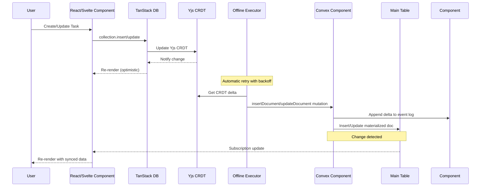
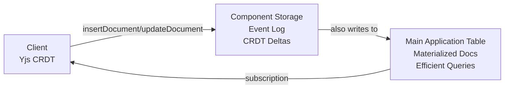
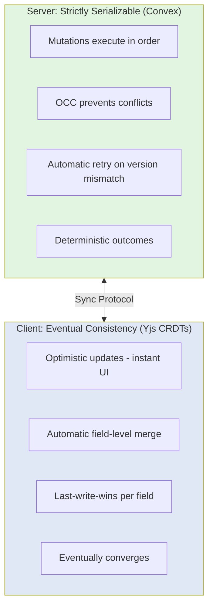
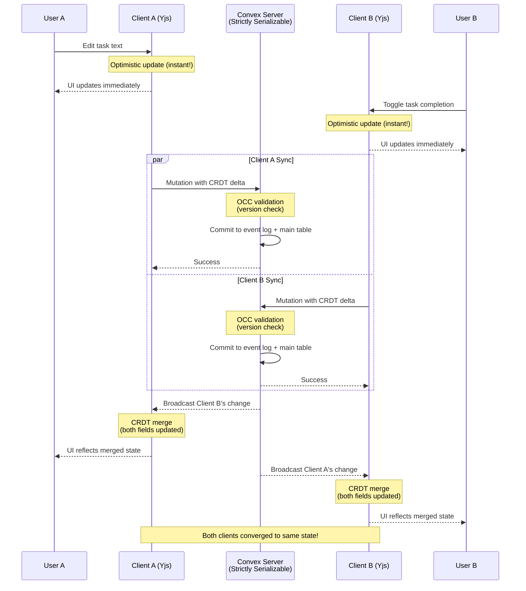

# Convex Replicate

**Offline-first sync library using Yjs CRDTs and Convex for real-time data synchronization.**

Convex Replicate provides a dual-storage architecture for building offline-capable applications with automatic conflict resolution. It combines Yjs CRDTs (96% smaller than Automerge, no WASM) with TanStack's offline transaction system and Convex's reactive backend for real-time synchronization and efficient querying.

## Features

- **Offline-first** - Works without internet, syncs when reconnected
- **Yjs CRDTs** - Automatic conflict-free replication with Yjs (96% smaller than Automerge, no WASM)
- **TanStack offline-transactions** - Proven outbox pattern for reliable offline sync
- **Real-time sync** - Convex WebSocket-based synchronization
- **TanStack DB integration** - Reactive state management for React and Svelte
- **Dual-storage pattern** - CRDT layer for conflict resolution + main tables for queries
- **Event sourcing** - Append-only event log preserves complete history
- **Type-safe** - Full TypeScript support
- **Multi-tab sync** - Changes sync instantly across browser tabs via TanStack coordination
- **SSR support** - Server-side rendering with data preloading
- **Network resilience** - Automatic retry with exponential backoff
- **Component-based** - Convex component for plug-and-play CRDT storage
- **React Native compatible** - No WASM dependency, works on mobile

## Architecture

### Data Flow: Real-Time Sync



### Dual-Storage Architecture



**Why both?**
- **Component Storage (Event Log)**: Append-only CRDT deltas, complete history, conflict resolution
- **Main Tables (Read Model)**: Current state, efficient server-side queries, indexes, and reactive subscriptions
- Similar to CQRS/Event Sourcing: component = event log, main table = materialized view

## Understanding Consistency Guarantees

Convex Replicate combines two different consistency models to give you the best of both worlds: **strict ordering on the server** and **optimistic updates on the client**.

### Two-Tier Consistency Model



### Server-Side: Strictly Serializable (Convex)

On the server, **Convex guarantees strictly serializable transactions**. This means:

- **Single-threaded illusion**: All mutations appear to execute one-at-a-time, in order
- **Optimistic Concurrency Control (OCC)**: Like Git - if two transactions touch the same data:
  - Both read at their snapshot time
  - First to commit wins
  - Second fails and automatically retries with fresh data
- **Deterministic**: Same operations always produce the same result
- **"It just works"**: Most developers never need to think about concurrency

**Example: OCC in action**
```typescript
// Two users try to update the same task simultaneously

// User A's mutation (starts first)
READ task (version: 1, text: "Buy milk")
WRITE task (version: 2, text: "Buy milk and eggs")
IF task.version === 1 → ✅ Success!

// User B's mutation (concurrent)
READ task (version: 1, text: "Buy milk")
WRITE task (version: 2, text: "Buy bread")
IF task.version === 1 → ❌ Conflict! (Task is now version 2)
// Convex automatically retries with fresh data:
READ task (version: 2, text: "Buy milk and eggs")
WRITE task (version: 3, text: "Buy bread")
IF task.version === 2 → ✅ Success!
```

### Client-Side: Eventual Consistency (Yjs CRDTs)

On the client, **Yjs CRDTs provide eventual consistency with automatic conflict resolution**. This means:

- **Optimistic updates**: Changes show immediately in the UI (no waiting for server)
- **Automatic merging**: CRDTs resolve conflicts at the field level
- **Last-write-wins**: By default, the most recent edit to each field wins
- **Convergent**: All clients eventually reach the same state

**Example: CRDT merge**
```typescript
// Two users edit different fields of the same task offline

// User A (offline):
task.update({ isCompleted: true })  // Toggle checkbox

// User B (offline):
task.update({ text: "Buy organic milk" })  // Edit text

// When both come online:
// ✅ Both changes merge automatically!
// Final state: { text: "Buy organic milk", isCompleted: true }
```

### How Server and Client Work Together



### When to Use Optimistic Updates

Not all operations are suitable for client-side optimistic updates. Use this guide:

| Use Case | Recommendation | Reason |
|----------|---------------|--------|
| **Text editing** | ✅ Perfect | CRDTs excel at merging text changes |
| **Task completion toggles** | ✅ Perfect | Commutative operations (order doesn't matter) |
| **Collaborative notes** | ✅ Perfect | Multiple users editing different parts |
| **UI preferences** | ✅ Perfect | Low stakes, user-specific |
| **Comment threads** | ✅ Good | Append-only, rare conflicts |
| **Like/favorite buttons** | ✅ Good | Idempotent operations |
| **Inventory counts** | ⚠️ Careful | May need server validation to prevent overselling |
| **Rate limiting** | ⚠️ Careful | Client can't enforce limits reliably |
| **Counter increments** | ⚠️ Careful | Use server-side aggregation for accuracy |
| **Financial transactions** | ❌ Never | Must be server-only with strict validation |
| **Authorization checks** | ❌ Never | Security decisions belong on server |
| **Billing operations** | ❌ Never | Legal/compliance requirements |

**Rule of thumb**: Ask yourself: *"Can this data be temporarily inconsistent for a few seconds?"*
- If **yes** → Safe for optimistic updates
- If **no** → Keep it server-only

### Understanding Conflicts

Convex Replicate handles two types of conflicts with different mechanisms:

#### Server Conflicts (OCC)
**Cause**: Two mutations modify the same document simultaneously
- **Detection**: Version number mismatch at commit time
- **Resolution**: Automatic retry with fresh snapshot
- **Result**: Deterministic ordering (one mutation wins, other retries)

```typescript
// Server detects: "This mutation read version 5, but it's now version 6"
// Convex automatically: Retry the mutation with version 6 data
```

#### Client Conflicts (CRDT)
**Cause**: Two users edit the same field offline
- **Detection**: CRDT vector clocks detect concurrent edits
- **Resolution**: Automatic field-level merge (last-write-wins by default)
- **Result**: Eventual consistency (both edits visible, most recent wins per field)

```typescript
// Client A: task.text = "Buy milk" (timestamp: 100)
// Client B: task.text = "Buy bread" (timestamp: 101)
// CRDT merge: task.text = "Buy bread" (last write wins)
```

**Key difference**: Server conflicts retry with new data. Client conflicts merge automatically.

### Best Practices

1. **Trust the server**: Use server mutations for business logic that must be correct
2. **Trust CRDTs for UX**: Use optimistic updates for immediate feedback on safe operations
3. **Validate on server**: Even with optimistic updates, always validate on the server
4. **Test offline scenarios**: Simulate offline mode to see how conflicts resolve
5. **Monitor conflict rates**: High conflict rates may indicate operations that shouldn't be optimistic

### Example: Good vs Bad Patterns

**✅ Good: Collaborative Task List**
```typescript
// Safe for optimistic updates
collection.update(taskId, (draft) => {
  draft.text = newText;        // Text editing - CRDTs handle this
  draft.isCompleted = !draft.isCompleted;  // Toggle - commutative
});
```

**❌ Bad: Inventory Decrement**
```typescript
// ❌ DON'T: Optimistic inventory decrement
collection.update(productId, (draft) => {
  draft.stock -= 1;  // Could lead to overselling!
});

// ✅ DO: Server-side with validation
await convexClient.mutation(api.products.decrementStock, {
  productId
});
// Server checks: if (product.stock > 0) then decrement
```

**✅ Good: Server-Only Financial Operation**
```typescript
// Keep money operations server-only
export const transferFunds = mutation({
  handler: async (ctx, { fromAccount, toAccount, amount }) => {
    // Strict validation, no optimistic updates
    const from = await ctx.db.get(fromAccount);
    if (from.balance < amount) {
      throw new Error("Insufficient funds");
    }

    // Atomic transaction
    await ctx.db.patch(fromAccount, {
      balance: from.balance - amount
    });
    await ctx.db.patch(toAccount, {
      balance: to.balance + amount
    });
  },
});
```

### Summary

- **Server = Strict ordering**: Convex ensures mutations execute in a deterministic order with OCC
- **Client = Optimistic merging**: Yjs CRDTs provide instant UI updates with automatic conflict resolution
- **Together**: You get both fast UX and correct business logic
- **Your job**: Choose the right tool for each operation (optimistic for UX, server-only for correctness)

This two-tier model gives you the best of both worlds: the **reliability of traditional databases** with the **responsiveness of real-time collaborative apps**.

## Installation

```bash
# Using pnpm (recommended)
pnpm add @trestleinc/replicate

# Using npm (v7+)
npm install @trestleinc/replicate

# Using Bun
bun add @trestleinc/replicate
```

## Quick Start

### Step 1: Install the Convex Component

Add the replicate component to your Convex app configuration:

```typescript
// convex/convex.config.ts
import { defineApp } from 'convex/server';
import replicate from '@trestleinc/replicate/convex.config';

const app = defineApp();
app.use(replicate);

export default app;
```

### Step 2: Define Your Schema

Use the `replicatedTable` helper to automatically inject required fields:

```typescript
// convex/schema.ts
import { defineSchema } from 'convex/server';
import { v } from 'convex/values';
import { replicatedTable } from '@trestleinc/replicate/server';

export default defineSchema({
  tasks: replicatedTable(
    {
      // Your application fields only!
      // version and timestamp are automatically injected by replicatedTable
      id: v.string(),
      text: v.string(),
      isCompleted: v.boolean(),
    },
    (table) => table
      .index('by_user_id', ['id'])      // Required for document lookups
      .index('by_timestamp', ['timestamp']) // Required for incremental sync
  ),
});
```

**What `replicatedTable` does:**
- Automatically injects `version: v.number()` (for CRDT versioning)
- Automatically injects `timestamp: v.number()` (for incremental sync)
- You only define your business logic fields

**Required indexes:**
- `by_user_id` on `['id']` - Enables fast document lookups during updates
- `by_timestamp` on `['timestamp']` - Enables efficient incremental synchronization

### Step 3: Create Replication Functions

Create functions that use replication helpers for dual-storage pattern:

```typescript
// convex/tasks.ts
import { mutation, query } from './_generated/server';
import { components } from './_generated/api';
import { v } from 'convex/values';
import {
  insertDocumentHelper,
  updateDocumentHelper,
  deleteDocumentHelper,
} from '@trestleinc/replicate/server'; // IMPORTANT: Use /server for Convex functions!

/**
 * TanStack DB endpoints - called by convexCollectionOptions
 * These receive Yjs CRDT deltas from client and write to both:
 * 1. Component storage (Yjs CRDT deltas in event log)
 * 2. Main table (materialized docs for efficient queries)
 */

export const insertDocument = mutation({
  args: {
    collection: v.string(),
    documentId: v.string(),
    crdtBytes: v.bytes(),
    materializedDoc: v.any(),
    version: v.number(),
  },
  handler: async (ctx, args) => {
    return await insertDocumentHelper(ctx, components, 'tasks', {
      id: args.documentId,
      crdtBytes: args.crdtBytes,
      materializedDoc: args.materializedDoc,
      version: args.version,
    });
  },
});

export const updateDocument = mutation({
  args: {
    collection: v.string(),
    documentId: v.string(),
    crdtBytes: v.bytes(),
    materializedDoc: v.any(),
    version: v.number(),
  },
  handler: async (ctx, args) => {
    return await updateDocumentHelper(ctx, components, 'tasks', {
      id: args.documentId,
      crdtBytes: args.crdtBytes,
      materializedDoc: args.materializedDoc,
      version: args.version,
    });
  },
});

export const deleteDocument = mutation({
  args: {
    collection: v.string(),
    documentId: v.string(),
    crdtBytes: v.bytes(),
    version: v.number(),
  },
  handler: async (ctx, args) => {
    return await deleteDocumentHelper(ctx, components, 'tasks', {
      id: args.documentId,
      crdtBytes: args.crdtBytes,
      version: args.version,
    });
  },
});

/**
 * Stream endpoint for real-time subscriptions
 * Returns all active items (hard deletes are physically removed from table)
 */
export const stream = query({
  handler: async (ctx) => {
    return await ctx.db.query('tasks').collect();
  },
});
```

### Step 4: Initialize ConvexReplicate

Initialize ConvexReplicate once when your application starts. This checks protocol versions and runs migrations if needed:

```typescript
// src/main.tsx (or app entry point)
import { ConvexHttpClient } from 'convex/browser';
import { initConvexReplicate } from '@trestleinc/replicate/client';
import { convexClient } from './router'; // Your ConvexClient instance

// Initialize ConvexReplicate before creating collections
await initConvexReplicate({ convexClient });

// Now you can safely create collections and use them in your app
```

**For React apps, you might want to wrap this in a provider:**

```typescript
// src/ConvexReplicateProvider.tsx
import { createContext, useContext, useEffect, useState } from 'react';
import { ConvexClient } from 'convex/browser';
import { initConvexReplicate } from '@trestleinc/replicate/client';

const ConvexReplicateContext = createContext<{ initialized: boolean }>({ initialized: false });

export function ConvexReplicateProvider({ 
  children, 
  convexClient 
}: { 
  children: React.ReactNode;
  convexClient: ConvexClient;
}) {
  const [initialized, setInitialized] = useState(false);

  useEffect(() => {
    initConvexReplicate({ convexClient })
      .then(() => setInitialized(true))
      .catch(error => {
        console.error('Failed to initialize ConvexReplicate:', error);
      });
  }, [convexClient]);

  return (
    <ConvexReplicateContext.Provider value={{ initialized }}>
      {initialized ? children : <div>Loading...</div>}
    </ConvexReplicateContext.Provider>
  );
}

export function useConvexReplicate() {
  return useContext(ConvexReplicateContext);
}
```

### Step 5: Create a Custom Hook

Create a hook that wraps TanStack DB with Convex collection options:

```typescript
// src/useTasks.ts
import { createCollection } from '@tanstack/react-db';
import {
  convexCollectionOptions,
  createConvexCollection,
  type ConvexCollection,
} from '@trestleinc/replicate/client';
import { api } from '../convex/_generated/api';
import { convexClient } from './router';
import { useMemo } from 'react';

export interface Task {
  id: string;
  text: string;
  isCompleted: boolean;
}

// Module-level singleton to prevent multiple collection instances
// This ensures only one sync process runs, even across component remounts
let tasksCollection: ConvexCollection<Task>;

export function useTasks(initialData?: ReadonlyArray<Task>) {
  return useMemo(() => {
    if (!tasksCollection) {
      // Step 1: Create raw TanStack DB collection with ALL config
      const rawCollection = createCollection(
        convexCollectionOptions<Task>({
          convexClient,
          api: {
            stream: api.tasks.stream,
            insertDocument: api.tasks.insertDocument,
            updateDocument: api.tasks.updateDocument,
            deleteDocument: api.tasks.deleteDocument,
          },
          collection: 'tasks',
          getKey: (task) => task.id,
          initialData,
        })
      );

      // Step 2: Wrap with Convex offline support (Yjs + TanStack)
      // Config is automatically extracted from rawCollection
      tasksCollection = createConvexCollection(rawCollection);
    }
    return tasksCollection;
  }, [initialData]);
}
```

### Step 6: Use in Components

```typescript
// src/routes/index.tsx
import { useLiveQuery } from '@tanstack/react-db';
import { useTasks } from '../useTasks';

export function TaskList() {
  const collection = useTasks();
  const { data: tasks, isLoading, isError } = useLiveQuery(collection);

  const handleCreate = () => {
    collection.insert({
      id: crypto.randomUUID(),
      text: 'New task',
      isCompleted: false,
    });
  };

  const handleUpdate = (id: string, isCompleted: boolean) => {
    collection.update(id, (draft: Task) => {
      draft.isCompleted = !isCompleted;
    });
  };

  const handleDelete = (id: string) => {
    // Hard delete - physically removes from main table
    collection.delete(id);
  };

  if (isError) {
    return <div>Error loading tasks. Please refresh.</div>;
  }

  if (isLoading) {
    return <div>Loading tasks...</div>;
  }

  return (
    <div>
      <button onClick={handleCreate}>Add Task</button>

      {tasks.map((task) => (
        <div key={task.id}>
          <input
            type="checkbox"
            checked={task.isCompleted}
            onChange={() => handleUpdate(task.id, task.isCompleted)}
          />
          <span>{task.text}</span>
          <button onClick={() => handleDelete(task.id)}>Delete</button>
        </div>
      ))}
    </div>
  );
}
```

## Delete Pattern: Hard Delete with Event History (v0.3.0+)

Convex Replicate uses **hard deletes** where items are physically removed from the main table, while the internal component preserves complete event history.

**Why hard delete?**
- Clean main table (no filtering required)
- Standard TanStack DB operations
- Complete audit trail preserved in component event log
- Proper CRDT conflict resolution maintained
- Foundation for future recovery features

**Implementation:**

```typescript
// Delete handler (uses collection.delete)
const handleDelete = (id: string) => {
  collection.delete(id);  // Hard delete - physically removes from main table
};

// UI usage - no filtering needed!
const { data: tasks } = useLiveQuery(collection);

// SSR loader - no filtering needed!
export const Route = createFileRoute('/')({
  loader: async () => {
    const tasks = await httpClient.query(api.tasks.stream);
    return { tasks };
  },
});
```

**How it works:**
1. Client calls `collection.delete(id)`
2. `onDelete` handler captures Yjs deletion delta
3. Delta appended to component event log (history preserved)
4. Main table: document physically removed
5. Other clients notified and item removed locally

**Server-side:** Returns only active items (deleted items are physically removed):

```typescript
// convex/tasks.ts
export const stream = query({
  handler: async (ctx) => {
    return await ctx.db.query('tasks').collect();
  },
});
```

**Dual Storage Architecture:**
- **Component Storage**: Append-only event log with complete history (including deletions)
- **Main Table**: Current state only (deleted items removed)

## Protocol Evolution & Migration

ConvexReplicate includes automatic protocol migration to handle package updates and breaking changes. When you update the NPM package and the protocol version changes, the system automatically migrates local IndexedDB structures.

### How It Works

1. **Initialization Check**: When `initConvexReplicate()` runs, it compares the server's protocol version with the locally stored version
2. **Automatic Migration**: If versions differ, it runs sequential migrations (v1 → v2 → v3)
3. **Local Storage Update**: The new version is stored locally for future checks

### Initialization

Always call `initConvexReplicate()` once when your app starts:

```typescript
import { ConvexClient } from 'convex/browser';
import { initConvexReplicate } from '@trestleinc/replicate/client';

const convexClient = new ConvexClient(process.env.VITE_CONVEX_URL!);

// Initialize before creating collections
await initConvexReplicate({ convexClient });
```

### Custom API Endpoints

If you have custom authentication or API endpoints:

```typescript
await initConvexReplicate({
  convexClient,
  api: {
    getProtocolVersion: async (client) => {
      // Custom implementation
      return { protocolVersion: 2 };
    },
  },
});
```

### Debugging Protocol Issues

Check protocol information:

```typescript
import { getProtocolInfo } from '@trestleinc/replicate/client';

const info = await getProtocolInfo(convexClient);
console.log('Server version:', info.serverVersion);
console.log('Local version:', info.localVersion);
console.log('Needs migration:', info.needsMigration);
```

### Reset Protocol Storage

For testing or troubleshooting:

```typescript
import { resetProtocolStorage } from '@trestleinc/replicate/client';

// ⚠️ Warning: This clears all protocol metadata
await resetProtocolStorage();
```

### Migration Best Practices

- **Always initialize** before creating collections
- **Handle initialization errors** gracefully in your app
- **Test migrations** by simulating version upgrades
- **Monitor protocol versions** in production for debugging

## Advanced Usage

### Server-Side Rendering (SSR)

Preload data on the server for instant page loads:

**Step 1: Create an SSR-friendly query**

```typescript
// convex/tasks.ts
export const getTasks = query({
  handler: async (ctx) => {
    return await ctx.db.query('tasks').collect();
  },
});
```

**Step 2: Load data in your route loader**

```typescript
// src/routes/index.tsx
import { createFileRoute } from '@tanstack/react-router';
import { ConvexHttpClient } from 'convex/browser';
import { api } from '../convex/_generated/api';
import type { Task } from '../useTasks';

const httpClient = new ConvexHttpClient(import.meta.env.VITE_CONVEX_URL);

export const Route = createFileRoute('/')({
  loader: async () => {
    const tasks = await httpClient.query(api.tasks.getTasks);
    return { tasks };
  },
});

function TasksPage() {
  const { tasks: initialTasks } = Route.useLoaderData();

  // Pass initialData to your hook
  const collection = useTasks(initialTasks);
  const { data: tasks } = useLiveQuery(collection);

  // No loading state on first render!
  return <TaskList tasks={tasks} />;
}
```

### Direct Component Usage (Advanced)

> **WARNING:** Using `ReplicateStorage` directly only writes to the component CRDT storage layer. It does NOT implement the dual-storage pattern (no writes to main table), which means:
> - You cannot query this data efficiently in Convex
> - You lose the benefits of reactive subscriptions on materialized docs
> - You'll need to manually handle materialization
> 
> **Recommended:** Use the replication helpers (`insertDocumentHelper`, etc.) shown in Step 3 for the full dual-storage pattern.

For advanced use cases where you need direct component access:

```typescript
// convex/tasks.ts
import { ReplicateStorage } from '@trestleinc/replicate/client';
import { mutation, query } from './_generated/server';
import { components } from './_generated/api';
import { v } from 'convex/values';

interface Task {
  id: string;
  text: string;
  isCompleted: boolean;
}

const tasksStorage = new ReplicateStorage<Task>(components.replicate, 'tasks');

export const insertTask = mutation({
  args: {
    id: v.string(),
    crdtBytes: v.bytes(),
    version: v.number(),
  },
  handler: async (ctx, args) => {
    return await tasksStorage.insertDocument(
      ctx,
      args.id,
      args.crdtBytes,
      args.version
    );
  },
});

export const updateTask = mutation({
  args: {
    id: v.string(),
    crdtBytes: v.bytes(),
    version: v.number(),
  },
  handler: async (ctx, args) => {
    return await tasksStorage.updateDocument(
      ctx,
      args.id,
      args.crdtBytes,
      args.version
    );
  },
});

export const streamChanges = query({
  args: {
    checkpoint: v.object({ lastModified: v.number() }),
    limit: v.optional(v.number()),
  },
  handler: async (ctx, args) => {
    return await tasksStorage.stream(ctx, args.checkpoint, args.limit);
  },
});
```

### Logging Configuration

Configure logging for debugging and development using LogTape:

```typescript
// src/routes/__root.tsx or app entry point
import { configure, getConsoleSink } from '@logtape/logtape';

await configure({
  sinks: { console: getConsoleSink() },
  loggers: [
    {
      category: ['convex-replicate'],
      lowestLevel: 'debug',  // 'debug' | 'info' | 'warn' | 'error'
      sinks: ['console']
    }
  ],
});
```

Get a logger instance for custom logging:

```typescript
import { getLogger } from '@trestleinc/replicate/client';

const logger = getLogger(['my-module']); // Accepts string or string array

logger.info('Operation started', { userId: '123' });
logger.warn('Something unexpected', { reason: 'timeout' });
logger.error('Operation failed', { error });
```

## API Reference

### Client-Side (`@trestleinc/replicate/client`)

#### `convexCollectionOptions<T>(config)`

Creates collection options for TanStack DB with Yjs CRDT integration.

**Config:**
```typescript
interface ConvexCollectionOptionsConfig<T> {
  convexClient: ConvexClient;
  api: {
    stream: FunctionReference;          // Real-time subscription endpoint
    insertDocument: FunctionReference;  // Insert mutation
    updateDocument: FunctionReference;  // Update mutation
    deleteDocument: FunctionReference;  // Delete mutation
  };
  collection: string;
  getKey: (item: T) => string | number;
  initialData?: ReadonlyArray<T>;
}
```

**Returns:** Collection options for `createCollection()`

**Example:**
```typescript
const rawCollection = createCollection(
  convexCollectionOptions<Task>({
    convexClient,
    api: {
      stream: api.tasks.stream,
      insertDocument: api.tasks.insertDocument,
      updateDocument: api.tasks.updateDocument,
      deleteDocument: api.tasks.deleteDocument,
    },
    collection: 'tasks',
    getKey: (task) => task.id,
    initialData,
  })
);

const collection = createConvexCollection(rawCollection);
```

#### `createConvexCollection<T>(rawCollection)`

Wraps a TanStack DB collection with offline support (Yjs + TanStack offline-transactions).

**Parameters:**
- `rawCollection` - Collection created with `createCollection(convexCollectionOptions(...))`

**Returns:** `ConvexCollection<T>` (just a type alias for `Collection<T>`)

**Example:**
```typescript
const collection = createConvexCollection(rawCollection);

// Use standard TanStack DB operations
collection.insert({ id: '1', text: 'Task 1', isCompleted: false });
collection.update('1', (draft) => { draft.isCompleted = true });
collection.delete('1');
```

#### `ReplicateStorage<TDocument>`

Type-safe API for direct component access (advanced).

**Constructor:**
```typescript
new ReplicateStorage<TDocument>(component, collection)
```

**Methods:**

##### `insertDocument(ctx, documentId, crdtBytes, version)`
Insert a new document with Yjs CRDT bytes.

**Parameters:**
- `ctx` - Convex mutation context
- `documentId` - Unique document identifier
- `crdtBytes` - ArrayBuffer containing Yjs CRDT bytes
- `version` - CRDT version number

**Returns:** `Promise<{ success: boolean }>`

##### `updateDocument(ctx, documentId, crdtBytes, version)`
Update an existing document with Yjs CRDT bytes.

**Parameters:**
- `ctx` - Convex mutation context
- `documentId` - Unique document identifier
- `crdtBytes` - ArrayBuffer containing Yjs CRDT bytes
- `version` - CRDT version number

**Returns:** `Promise<{ success: boolean }>`

##### `deleteDocument(ctx, documentId, crdtBytes, version)`
Delete a document (appends deletion delta to event log).

**Parameters:**
- `ctx` - Convex mutation context
- `documentId` - Unique document identifier
- `crdtBytes` - ArrayBuffer containing Yjs deletion delta
- `version` - CRDT version number

**Returns:** `Promise<{ success: boolean }>`

##### `stream(ctx, checkpoint, limit?)`
Pull document changes for incremental sync.

**Parameters:**
- `ctx` - Convex query context
- `checkpoint` - Object with `{ lastModified: number }`
- `limit` - Optional max changes (default: 100)

**Returns:**
```typescript
Promise<{
  changes: Array<{
    documentId: string;
    crdtBytes: ArrayBuffer;
    version: number;
    timestamp: number;
  }>;
  checkpoint: { lastModified: number };
  hasMore: boolean;
}>
```

#### `getLogger(category)`

Get a logger instance for custom logging.

**Parameters:**
- `category: string | string[]` - Logger category

**Returns:** Logger with `debug()`, `info()`, `warn()`, `error()` methods

**Examples:**
```typescript
const logger = getLogger('my-module');
const logger = getLogger(['hooks', 'useTasks']);

logger.debug('Task created', { id: taskId });
```

### Server-Side (`@trestleinc/replicate/server`)

#### `insertDocumentHelper(ctx, components, tableName, args)`

Insert a document into both the CRDT component and the main application table.

**Parameters:**
- `ctx` - Convex mutation context
- `components` - Generated components from Convex
- `tableName` - Name of the main application table
- `args` - `{ id: string; crdtBytes: ArrayBuffer; materializedDoc: any; version: number }`

**Returns:** `Promise<{ success: boolean; metadata: {...} }>`

#### `updateDocumentHelper(ctx, components, tableName, args)`

Update a document in both the CRDT component and the main application table.

**Parameters:**
- `ctx` - Convex mutation context
- `components` - Generated components from Convex
- `tableName` - Name of the main application table
- `args` - `{ id: string; crdtBytes: ArrayBuffer; materializedDoc: any; version: number }`

**Returns:** `Promise<{ success: boolean; metadata: {...} }>`

#### `deleteDocumentHelper(ctx, components, tableName, args)`

Hard delete from main table, append deletion delta to component event log.

**Parameters:**
- `ctx` - Convex mutation context
- `components` - Generated components from Convex
- `tableName` - Name of the main application table
- `args` - `{ id: string; crdtBytes: ArrayBuffer; version: number }`

**Returns:** `Promise<{ success: boolean; metadata: {...} }>`

#### `streamHelper(ctx, components, tableName, args)`

Stream CRDT deltas from component storage for incremental sync.

**Parameters:**
- `ctx` - Convex query context
- `components` - Generated components from Convex
- `tableName` - Name of the collection
- `args` - `{ checkpoint: { lastModified: number }; limit?: number }`

**Returns:** `Promise<{ changes: Array<...>; checkpoint: {...}; hasMore: boolean }>`

#### `replicatedTable(userFields, applyIndexes?)`

Automatically inject replication metadata fields (`version`, `timestamp`).

**Parameters:**
- `userFields` - User's business logic fields
- `applyIndexes` - Optional callback to add indexes

**Returns:** TableDefinition with replication fields injected

**Example:**
```typescript
tasks: replicatedTable(
  {
    id: v.string(),
    text: v.string(),
  },
  (table) => table
    .index('by_user_id', ['id'])
    .index('by_timestamp', ['timestamp'])
)
```

### SSR (`@trestleinc/replicate/ssr`)

#### `loadCollection<T>(httpClient, config)`

Load collection data during SSR for instant page loads.

**Note:** This function is deprecated. For most SSR use cases, create a dedicated query that reads from your main table.

**Parameters:**
- `httpClient` - ConvexHttpClient instance
- `config` - `{ api: CollectionAPI; collection: string; limit?: number }`

**Returns:** `Promise<ReadonlyArray<T>>`

## Performance

### Storage Performance

- **IndexedDB** via TanStack DB provides efficient local storage
- **Yjs** CRDT operations are extremely fast (96% smaller than Automerge)
- **TanStack offline-transactions** provides batching and retry logic
- **Indexed queries** in Convex for fast incremental sync

### Sync Performance

- **Real-time updates** - WebSocket-based change notifications
- **Delta encoding** - Only send what changed (< 1KB per change vs 100KB+ full state)
- **Event sourcing** - Append-only writes, no update conflicts
- **Optimistic UI** - Instant updates without waiting for server

### Multi-Tab Sync

- **TanStack coordination** - Built-in multi-tab sync via BroadcastChannel
- **Yjs shared state** - Single source of truth per browser
- **Offline executor** - Only one tab runs sync operations

## Offline Behavior

### How It Works

- **Writes** - Queue locally in Yjs CRDT, sync when online via TanStack outbox
- **Reads** - Always work from local TanStack DB cache (instant!)
- **UI** - Fully functional with optimistic updates
- **Conflicts** - Auto-resolved by Yjs CRDTs (conflict-free!)

### Network Resilience

- Automatic retry with exponential backoff
- Network error detection (fetch errors, connection issues)
- Queue changes while offline
- Graceful degradation

## Examples

Complete working example: `examples/tanstack-start/`

**Files to explore:**
- `src/useTasks.ts` - Hook with TanStack DB integration
- `src/routes/index.tsx` - Component usage with SSR
- `src/routes/__root.tsx` - Logging configuration
- `convex/tasks.ts` - Replication functions using dual-storage helpers
- `convex/schema.ts` - Schema with `replicatedTable` helper

**Run the example:**
```bash
cd examples/tanstack-start
pnpm install
pnpm run dev
```

## Development

### Building

```bash
pnpm run build         # Build package using Rslib
pnpm run clean         # Remove build artifacts
pnpm run typecheck     # Type check
```

### Code Quality

```bash
pnpm run check         # Lint + format check (dry run)
pnpm run check:fix     # Auto-fix all issues (run before committing)
pnpm run lint          # Lint only
pnpm run lint:fix      # Auto-fix lint issues
pnpm run format        # Format only
pnpm run format:check  # Check formatting
```

### Running Example

```bash
pnpm run dev:example   # Start example app + Convex dev environment
```

## Roadmap

- [ ] Partial sync (sync subset of collection)
- [ ] Delta sync (only sync changed fields)
- [ ] Encryption at rest
- [ ] Attachment support (files, images)
- [x] React Native support (works with Yjs v0.3.0+)
- [ ] Advanced Yjs features (rich text editing, shared cursors)
- [ ] Recovery features (restore deleted items from event log)

## Contributing

Contributions welcome! Please see `CLAUDE.md` for coding standards.

## License

Apache-2.0 License - see [LICENSE](./LICENSE) file for details.

Copyright 2025 Trestle Inc
