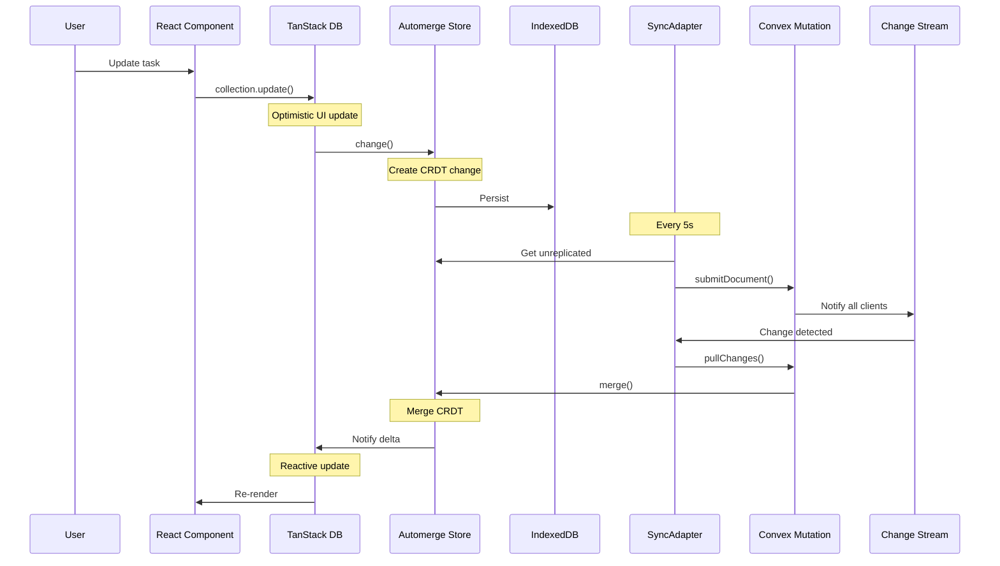

# Convex Replicate

**Offline-first local-first sync library bridging Automerge CRDTs (local) and Convex (cloud) for real-time data synchronization.**

Convex Replicate provides a framework-agnostic core for building offline-capable applications with real-time sync, using Automerge for automatic conflict resolution and TanStack DB for reactive state management.

## Features

- **Offline-first** - Works without internet, syncs when reconnected
- **CRDT-based** - Automerge provides automatic conflict-free merging
- **Real-time bidirectional sync** - Convex WebSocket-based synchronization
- **Framework-agnostic** - Use with React, Vue, Svelte, or vanilla JS
- **TanStack DB integration** - Reactive state management out of the box
- **Type-safe** - Full TypeScript support
- **IndexedDB persistence** - Automatic local storage with hydration
- **Cross-tab sync** - Changes sync instantly across browser tabs
- **SSR support** - Server-side rendering with data preloading
- **Zero configuration** - Sensible defaults, easy to customize

## Architecture

### High-Level Overview

```mermaid
graph TB
    App[Application Layer<br/>Your React Components]
    TanStack[TanStack DB/React<br/>• createCollection<br/>• useLiveQuery<br/>• Reactive state]
    Core[@convex-rx/core<br/>• convexAutomergeCollectionOptions<br/>• AutomergeDocumentStore<br/>• SyncAdapter<br/>• Convex helpers<br/>• SSR utilities]
    Automerge[Automerge CRDT<br/>IndexedDB Persistence]
    Convex[Convex Cloud<br/>• Database<br/>• Functions<br/>• WebSocket]
    
    App --> TanStack
    TanStack --> Core
    Core --> Automerge
    Core <--> Convex
    Automerge <--> Convex
```

### Data Flow: Real-Time Sync


```mermaid
sequenceDiagram
    participant User
    participant Component as React Component
    participant TanStack as TanStack DB
    participant Store as Automerge Store
    participant IDB as IndexedDB
    participant Sync as SyncAdapter
    participant Convex as Convex Mutation
    participant WS as Change Stream
    
    User->>Component: Update task
    Component->>TanStack: collection.update()
    Note over TanStack: Optimistic UI update
    TanStack->>Store: change()
    Note over Store: Create CRDT change
    Store->>IDB: Persist
    Note over Sync: Every 5s
    Sync->>Store: Get unreplicated
    Sync->>Convex: submitDocument()
    Convex->>WS: Notify all clients
    WS->>Sync: Change detected
    Sync->>Convex: pullChanges()
    Convex->>Store: merge()
    Note over Store: Merge CRDT
    Store->>TanStack: Notify delta
    Note over TanStack: Reactive update
    TanStack->>Component: Re-render
```

## Packages

### `@convex-rx/core`

**The complete sync engine** - Framework-agnostic, works with any JavaScript framework.

**What it includes:**
- `AutomergeDocumentStore` - CRDT document management with IndexedDB persistence
- `SyncAdapter` - Bidirectional sync coordinator (push/pull)
- `convexAutomergeCollectionOptions()` - TanStack DB collection configuration
- Convex helper functions for server-side queries/mutations
- SSR data loading utilities
- Structured logging with LogTape

**Use cases:**
- React applications (with `@tanstack/react-db`)
- Vue applications (with `@tanstack/vue-db`)
- Svelte applications (with `@tanstack/svelte-db`)
- Vanilla JavaScript
- Any framework with TanStack DB support

**Key exports:**
- `AutomergeDocumentStore` - CRDT document store
- `SyncAdapter` - Sync coordinator
- `convexAutomergeCollectionOptions()` - TanStack DB config factory
- `submitDocumentHelper()`, `pullChangesHelper()`, `changeStreamHelper()` - Convex server helpers
- `loadConvexData()` - SSR data preloading
- `configureLogger()`, `getConvexReplicateLogger()` - Logging

### `@convex-rx/storage` (Optional)

**Convex component for CRDT storage** - Optional Convex component providing dedicated binary storage for Automerge documents.

Currently not used in the default setup (data is stored in regular Convex tables), but available for advanced use cases requiring dedicated CRDT storage with deduplication.

## Installation

```bash
# Core dependencies
bun add @convex-rx/core convex @automerge/automerge @automerge/automerge-repo-storage-indexeddb

# For React
bun add @tanstack/react-db @tanstack/db

# For Vue
bun add @tanstack/vue-db @tanstack/db

# For Svelte
bun add @tanstack/svelte-db @tanstack/db
```

## Quick Start (React + TanStack Start)

### Step 1: Define Convex Schema

```typescript
// convex/schema.ts

import { defineSchema, defineTable } from 'convex/server';
import { v } from 'convex/values';

export default defineSchema({
  tasks: defineTable({
    id: v.string(),
    text: v.string(),
    isCompleted: v.boolean(),
    version: v.number(),
    timestamp: v.number(),
    deleted: v.optional(v.boolean()),
  })
    .index('by_user_id', ['id'])
    .index('by_timestamp', ['timestamp']),
});
```

**Required fields:**
- `id` - Client-generated UUID
- `version` - Automerge version number
- `timestamp` - Server timestamp for sync ordering
- `deleted` - Optional soft delete flag

### Step 2: Create Convex Functions

Use the helper functions to create your Convex API endpoints:

```typescript
// convex/tasks.ts

import {
  submitDocumentHelper,
  pullChangesHelper,
  changeStreamHelper,
} from '@convex-rx/core/convex-helpers';
import { mutation, query } from './_generated/server';
import { components } from './_generated/api';
import { v } from 'convex/values';

export const submitDocument = mutation({
  args: {
    id: v.string(),
    document: v.any(),
    version: v.number(),
  },
  handler: async (ctx, args) => {
    return await submitDocumentHelper(ctx, components, 'tasks', args);
  },
});

export const pullChanges = query({
  args: {
    checkpoint: v.object({
      lastModified: v.number(),
    }),
    limit: v.optional(v.number()),
  },
  handler: async (ctx, args) => {
    return await pullChangesHelper(ctx, 'tasks', args);
  },
});

export const changeStream = query({
  handler: async (ctx) => {
    return await changeStreamHelper(ctx, 'tasks');
  },
});
```

**What these helpers do:**
- `submitDocumentHelper` - Saves document to both storage component (if configured) and main table
- `pullChangesHelper` - Queries documents with timestamp-based pagination
- `changeStreamHelper` - Returns latest timestamp for WebSocket change detection

### Step 3: Create Collection Hook

```typescript
// src/hooks/useTasks.ts

import { createCollection } from '@tanstack/react-db';
import { convexAutomergeCollectionOptions } from '@convex-rx/core';
import { api } from '../convex/_generated/api';
import { convexClient } from '../router'; // Your Convex client instance
import { useMemo } from 'react';

export interface Task {
  id: string;
  text: string;
  isCompleted: boolean;
}

let tasksCollection: ReturnType<typeof createCollection<Task>> | null = null;

export function useTasks(initialData?: ReadonlyArray<Task>) {
  return useMemo(() => {
    if (!tasksCollection) {
      tasksCollection = createCollection(
        convexAutomergeCollectionOptions<Task>({
          convexClient,
          api: api.tasks,
          collectionName: 'tasks',
          getKey: (task) => task.id,
          initialData,
        })
      );
    }
    return tasksCollection;
  }, [initialData]);
}
```

**Collection singleton pattern:**
- Creates collection once per app lifecycle
- Reuses same collection instance across component renders
- Prevents duplicate sync adapters and WebSocket connections

### Step 4: Use in Components

```typescript
// src/routes/index.tsx

import { useLiveQuery } from '@tanstack/react-db';
import { useTasks } from '../hooks/useTasks';
import { useState } from 'react';

export function TaskList() {
  const [newTaskText, setNewTaskText] = useState('');
  
  const collection = useTasks();
  const { data: tasks, isLoading, isError } = useLiveQuery(collection);

  const handleCreateTask = (e: React.FormEvent) => {
    e.preventDefault();
    if (newTaskText.trim()) {
      const id = crypto.randomUUID();
      collection.insert({ id, text: newTaskText.trim(), isCompleted: false });
      setNewTaskText('');
    }
  };

  const handleToggle = (id: string) => {
    collection.update(id, (draft) => {
      draft.isCompleted = !draft.isCompleted;
    });
  };

  const handleDelete = (id: string) => {
    collection.delete(id);
  };

  if (isError) return <div>Error loading tasks</div>;
  if (isLoading) return <div>Loading...</div>;

  return (
    <div>
      <form onSubmit={handleCreateTask}>
        <input
          type="text"
          value={newTaskText}
          onChange={(e) => setNewTaskText(e.target.value)}
          placeholder="Add a new task..."
        />
        <button type="submit">Add</button>
      </form>

      {tasks.map((task) => (
        <div key={task.id}>
          <input
            type="checkbox"
            checked={task.isCompleted}
            onChange={() => handleToggle(task.id)}
          />
          <span>{task.text}</span>
          <button onClick={() => handleDelete(task.id)}>Delete</button>
        </div>
      ))}
    </div>
  );
}
```

## Server-Side Rendering (SSR)

Preload data on the server for instant page loads:

```typescript
// TanStack Start loader
import { createFileRoute } from '@tanstack/react-router';
import { loadConvexData } from '@convex-rx/core/ssr';
import { ConvexHttpClient } from 'convex/browser';
import { api } from '../convex/_generated/api';
import type { Task } from '../hooks/useTasks';

const httpClient = new ConvexHttpClient(import.meta.env.VITE_CONVEX_URL);

export const Route = createFileRoute('/')({
  loader: async () => {
    const tasks = await loadConvexData<Task>(
      httpClient,
      api.tasks.pullChanges,
      { limit: 100 }
    );
    return { tasks };
  },
});

// Component
function TasksPage() {
  const { tasks: initialTasks } = Route.useLoaderData();
  const collection = useTasks(initialTasks);
  
  // No loading state on first render!
  const { data: tasks } = useLiveQuery(collection);

  return <TaskList tasks={tasks} />;
}
```

## API Reference

### `@convex-rx/core`

#### `convexAutomergeCollectionOptions<T>(config)`

Creates TanStack DB collection config with Automerge sync.

```typescript
interface ConvexAutomergeCollectionConfig<T extends { id: string }> {
  convexClient: ConvexClient;
  api: {
    pullChanges: FunctionReference<'query'>;
    submitDocument: FunctionReference<'mutation'>;
    changeStream: FunctionReference<'query'>;
  };
  collectionName: string;
  getKey: (item: T) => string | number;
  id?: string;
  schema?: unknown;
  initialData?: ReadonlyArray<T>;
  enableReplicate?: boolean; // Default: true
}

function convexAutomergeCollectionOptions<T>(
  config: ConvexAutomergeCollectionConfig<T>
): CollectionConfig<T>;
```

**Returns:** TanStack DB `CollectionConfig` with:
- Automatic sync setup (push/pull)
- WebSocket change notifications
- IndexedDB persistence
- Delta tracking for efficient updates

#### `AutomergeDocumentStore<T>`

Core CRDT document store with IndexedDB persistence.

```typescript
class AutomergeDocumentStore<T extends { id: string }> {
  constructor(collectionName: string);
  
  // Lifecycle
  initialize(): Promise<void>;
  
  // CRUD operations (return Automerge binary data)
  create(id: string, data: Omit<T, 'id'>): Uint8Array;
  change(id: string, updateFn: (draft: T) => void): Uint8Array | null;
  remove(id: string): Uint8Array | null; // Soft delete
  merge(id: string, bytes: Uint8Array): void;
  
  // State access
  toArray(): T[];
  getMaterialized(id: string): T | undefined;
  
  // Replication tracking
  getUnreplicatedMaterialized(): Array<{
    id: string;
    document: T;
    version: number;
  }>;
  markReplicated(id: string): void;
  
  // Reactivity
  subscribe(listener: (docs: T[]) => void): () => void;
  subscribeToDelta(listener: (delta: StoreDelta<T>) => void): () => void;
}

interface StoreDelta<T> {
  inserted: T[];
  updated: T[];
  deleted: string[];
}
```

#### `SyncAdapter<T>`

Handles bidirectional sync with Convex (push/pull cycle).

```typescript
class SyncAdapter<T extends { id: string }> {
  constructor(
    store: AutomergeDocumentStore<T>,
    client: ConvexClient,
    api: {
      pullChanges: FunctionReference<'query'>;
      submitDocument: FunctionReference<'mutation'>;
      changeStream: FunctionReference<'query'>;
    },
    collectionName: string
  );
  
  start(): Promise<void>; // Start push (5s interval) + pull (WebSocket)
  stop(): void; // Stop sync
}
```

#### Convex Helper Functions

Server-side utilities for Convex functions:

```typescript
// Submit document to storage component + main table
submitDocumentHelper<DataModel>(
  ctx: GenericMutationCtx<DataModel>,
  components: any,
  tableName: string,
  args: { id: string; document: any; version: number }
): Promise<{ success: boolean }>;

// Pull changes with timestamp-based pagination
pullChangesHelper<DataModel>(
  ctx: GenericQueryCtx<DataModel>,
  tableName: string,
  args: { checkpoint: { lastModified: number }; limit?: number }
): Promise<{
  changes: Array<{
    documentId: any;
    document: any;
    version: any;
    timestamp: any;
  }>;
  checkpoint: { lastModified: number };
  hasMore: boolean;
}>;

// Change stream for WebSocket notifications
changeStreamHelper<DataModel>(
  ctx: GenericQueryCtx<DataModel>,
  tableName: string
): Promise<{ timestamp: number; count: number }>;
```

#### SSR Data Loading

```typescript
loadConvexData<TItem extends { id: string }>(
  httpClient: ConvexHttpClient,
  pullChangesQuery: FunctionReference<'query'>,
  options?: { limit?: number }
): Promise<ReadonlyArray<TItem>>;
```

#### Logging

```typescript
import { configure, getConsoleSink } from '@logtape/logtape';

// Configure LogTape (typically in app entry point)
await configure({
  sinks: { console: getConsoleSink() },
  loggers: [
    {
      category: ['convex-replicate'],
      lowestLevel: 'debug',
      sinks: ['console'],
    },
  ],
});

// Get logger in your code
import { getConvexReplicateLogger } from '@convex-rx/core';

const logger = getConvexReplicateLogger(['my-module', 'sub-category']);

logger.debug('Message', { context: 'data' });
logger.info('Message', { context: 'data' });
logger.warn('Message', { context: 'data' });
logger.error('Message', { context: 'data' });
```

### TanStack DB Collection API

When you create a collection with `convexAutomergeCollectionOptions`, you get a TanStack DB collection with CRUD operations:

```typescript
import { createCollection } from '@tanstack/react-db';
import { useLiveQuery } from '@tanstack/react-db';

const collection = createCollection(convexAutomergeCollectionOptions({...}));

// CRUD operations
collection.insert(item: T): void;
collection.update(id: string, updateFn: (draft: T) => void): void;
collection.delete(id: string): void;

// React hook for reactive queries
const { data, isLoading, isError } = useLiveQuery(collection);
```

## How It Works

### Conflict Resolution

Convex Replicate uses **Automerge CRDTs** for automatic conflict-free merging:

- **No manual conflict handlers needed** - Automerge automatically merges concurrent changes
- **Last-write-wins per field** - Each field independently tracks its history
- **Automatic merge on sync** - When pulling changes, Automerge merges remote state with local changes
- **Deterministic** - Same changes always produce the same result

### Offline Behavior

- **Writes** - Queue locally in Automerge + IndexedDB, sync when online
- **Reads** - Always work from local Automerge cache (instant!)
- **UI** - Fully functional with optimistic updates
- **Conflicts** - Auto-resolved by Automerge when reconnected

### Network Resilience

- Automatic retry on network errors
- Push interval: Every 5 seconds
- Pull on WebSocket change notifications
- Queue changes while offline

### Cross-Tab Sync

- IndexedDB shared across tabs (same origin)
- Automerge documents persisted and loaded from IndexedDB on initialization
- Changes sync via Convex WebSocket to all connected tabs

## Development

### Building Packages

```bash
bun run build         # Build all packages (storage → core)
bun run build:core    # Build core only
bun run build:storage # Build storage component only
bun run clean         # Remove build artifacts
```

### Type Checking

```bash
bun run typecheck       # Check all packages
bun run typecheck:core  # Check core only
```

### Code Quality

```bash
bun run check         # Lint + format check (dry run)
bun run check:fix     # Auto-fix all issues (run before committing)
bun run lint          # Lint only
bun run lint:fix      # Auto-fix lint issues
bun run format        # Format only
bun run format:check  # Check formatting
```

### Running Example

```bash
bun run dev:example   # Start example app + Convex dev environment
```

## Examples

Complete working example: `examples/tanstack-start/`

**Files to explore:**
- `src/hooks/useTasks.ts` - Collection creation with TanStack DB
- `src/routes/index.tsx` - Component with CRUD operations
- `src/routes/__root.tsx` - LogTape configuration
- `convex/tasks.ts` - Convex functions using helper functions
- `convex/schema.ts` - Convex schema definition

## Architecture Notes

### Why Automerge?

- **Automatic conflict resolution** - No manual conflict handlers needed
- **CRDT-based** - Mathematically proven to converge
- **Efficient** - Binary format, incremental saves
- **Offline-first** - Designed for distributed systems

### Why TanStack DB?

- **Framework-agnostic** - Works with React, Vue, Solid, Svelte, etc.
- **Reactive** - Automatic re-renders on data changes
- **Flexible** - Custom sync adapters
- **TypeScript-first** - Excellent type inference

### Why Convex?

- **Real-time** - WebSocket-based change notifications
- **Type-safe** - Full TypeScript support
- **Serverless** - No infrastructure management
- **Reactive** - Automatic cache invalidation

### Why Not a React Package?

The library is intentionally **framework-agnostic**. TanStack DB provides framework-specific bindings (`@tanstack/react-db`, `@tanstack/vue-db`, etc.), so there's no need for a separate React wrapper. This keeps the architecture simple and enables use with any framework.

## TypeScript Best Practices

This library follows strict TypeScript standards:

- **Zero `any` types** - Use `unknown` for truly unknown values
- **Const object pattern** instead of enums
- **Explicit return types** on exported functions
- **Trust TypeScript** - No redundant runtime checks for typed values
- **Proper generic constraints** for type safety

See `CLAUDE.md` for detailed coding standards.

## Roadmap

- [ ] Partial sync (sync subset of collection)
- [ ] Encryption at rest
- [ ] Attachment support (files, images)
- [ ] Performance optimizations (delta compression)
- [ ] Advanced Automerge features (text editing, rich data types)
- [ ] Migration utilities for schema changes

## Contributing

Contributions welcome! Please see `CLAUDE.md` for coding standards.

## License

MIT License - see LICENSE file for details.
